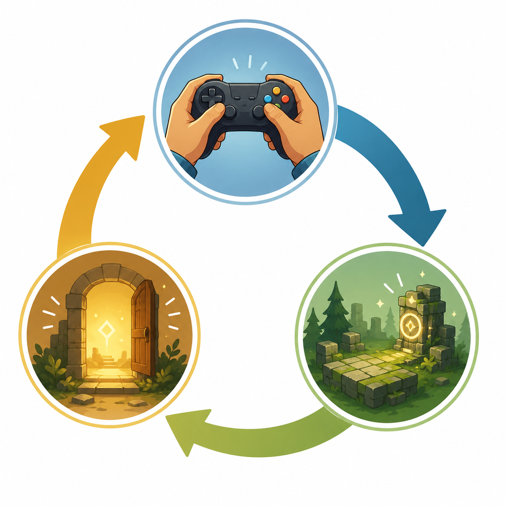

# Kapitel 3: Kärnloopen

## Varför detta kapitel finns

Många nya spelidéer beskrivs som miljöer, berättelser eller genrer: “ett äventyr i en ruin”, “ett snabbt actionspel” eller “ett pusselspel med magi”. Det kan vara en bra start, men det säger inte alltid vad spelaren faktiskt gör om och om igen.

Det här kapitlet handlar om **kärnloopen**: den återkommande cykel som gör att spelaren agerar, får respons, tolkar resultatet och väljer nästa handling. För en utvecklare är kärnloopen särskilt viktig eftersom den fungerar som en bro mellan designidé och faktisk implementation. Den hjälper dig att se vad spelet behöver stödja, testa och förstärka.

## Lärandemål

Efter kapitlet ska läsaren kunna:

- förklara vad en kärnloop är och varför den är central i speldesign
- skilja mellan en enskild mekanik och en återkommande loop
- identifiera handling, respons och belöning i en enkel spelstruktur
- analysera hur en kärnloop påverkar tempo, motivation och genre
- skissa en kärnloop för ett eget eller existerande spel

## Innan vi börjar

I kapitel 1 skilde vi mellan idé, mekanik, regler och upplevelse. I kapitel 2 såg vi hur mål och motivation ger spelaren riktning. Kärnloopen binder ihop dessa delar.

En mekanik kan vara att hoppa, samla, sikta, placera ett kort eller öppna en dörr. Ett mål kan vara att ta sig vidare, vinna en strid eller lösa ett mysterium. Kärnloopen beskriver hur mekaniker och mål upprepas i ett mönster som skapar spelets grundrytm.

## Huvudförklaring

### Kärnloopen som återkommande cykel

En **kärnloop** är den viktigaste återkommande cykeln i spelet. Den beskriver vad spelaren gör, vad spelet svarar med och varför spelaren vill fortsätta.

En enkel modell är:

1. Spelaren gör en handling.
2. Spelet ger respons.
3. Spelaren får någon form av belöning, förändring eller ny information.
4. Spelaren väljer nästa handling.

I ett enkelt plattformsspel kan loopen vara:

1. Spring och hoppa över hinder.
2. Spelet visar rörelse, kollisioner, fiender och poäng.
3. Spelaren når ny mark, samlar föremål eller undviker fara.
4. Spelaren fortsätter framåt mot nästa hinder.

I ett pusselspel kan loopen vara:

1. Observera situationen och testa en lösning.
2. Spelet visar om draget fungerar eller skapar ett nytt problem.
3. Spelaren får insikt, öppnar en väg eller förstår en regel bättre.
4. Spelaren testar nästa drag.

Loopen behöver alltså inte handla om snabb action. Den kan vara långsam, taktisk, social, utforskande eller analytisk.

### Handling, respons och belöning

En användbar kärnloop kan ofta delas upp i tre delar: **handling**, **respons** och **belöning**.

**Handling** är det spelaren gör. Det kan vara ett knapptryck, ett strategiskt beslut, ett samtalsval eller en förflyttning.

**Respons** är spelets svar. Det kan vara animation, ljud, poäng, skada, text, ny information eller en ändrad värld.

**Belöning** är det som gör handlingen meningsfull. Belöningen behöver inte vara ett föremål. Den kan vara förståelse, trygghet, kontroll, upptäckt, spänning eller en ny möjlighet.

Exempel från Skogsruinen:

| Del | Exempel |
|---|---|
| Handling | Spelaren undersöker en sprucken vägg. |
| Respons | Spelet visar ett ljud, damm och en liten öppning. |
| Belöning | Spelaren hittar en hemlig korridor och får en ny riktning. |

Det viktiga är inte bara att belöningen finns, utan att spelaren uppfattar sambandet mellan sin handling och resultatet. Om spelaren inte förstår varför något hände blir loopen svagare.

*Figur 3.1: En enkel kärnloop där spelarens handling leder till respons och ny motivation.*

### Kärnloop och spelrytm

**Spelrytm** handlar om hur ofta och med vilken intensitet loopen upprepas. En snabb loop kan kännas omedelbar och intensiv. En långsam loop kan kännas eftertänksam och strategisk.

Ett actionspel kan ha en loop som upprepas flera gånger per sekund:

1. Sikta.
2. Skjut eller undvik.
3. Se träff, miss eller skada.
4. Justera position.

Ett strategispel kan ha en loop som pågår över flera minuter:

1. Samla information.
2. Planera drag.
3. Utför beslut.
4. Se konsekvenser över tid.

Det är vanligt att nya designers fokuserar på vad som ska finnas i spelet, men inte på hur ofta spelaren ska fatta meningsfulla beslut. Kärnloopen hjälper dig att ställa frågan: “Vad gör spelaren igen, igen och igen, och varför är det fortfarande intressant?”

### Kärnloop är inte samma sak som hela spelet

Ett spel kan ha många loopar. Kärnloopen är den mest centrala, men den kan vara omgiven av mindre och större loopar.

I ett äventyrsspel kan det se ut så här:

| Loopnivå | Exempel |
|---|---|
| Mikroloop | Titta, gå, interagera, få respons. |
| Kärnloop | Utforska område, hitta ledtråd, lås upp ny plats. |
| Metaloop | Samla kunskap, förstå ruinen, närma dig slutmålet. |

En mikroloop är ofta mycket konkret. Den handlar om sekunder eller minuter. En metaloop är större och kan omfatta hela spelpass eller hela spelet. Kärnloopen ligger ofta mellan dessa: tillräckligt konkret för att styra designen, men tillräckligt stor för att beskriva spelets huvudsakliga aktivitet.

### När kärnloopen är oklar

Om ett spel känns spretigt finns ofta en oklar kärnloop bakom problemet. Spelet kanske har många idéer, men ingen tydlig återkommande aktivitet som bär upp upplevelsen.

Tecken på en oklar kärnloop:

- spelaren vet inte vad som är viktigt att göra
- olika system drar åt olika håll
- belöningar känns slumpmässiga eller irrelevanta
- spelet har innehåll, men saknar rytm
- det är svårt att avgöra vad som bör testas först

En tydlig kärnloop gör inte automatiskt spelet bra, men den gör spelet lättare att analysera. Den hjälper dig att prioritera: det som stärker kärnloopen är viktigt, medan sådant som stör den bör ifrågasättas.

## Exempel: Skogsruinen

Vi använder vårt återkommande exempel Skogsruinen. Grundidén är att spelaren utforskar en övergiven ruin i en skog. I tidigare kapitel har vi använt nycklar, dörrar, sigill, ledtrådar och förseglade kammare.

En möjlig kärnloop är:

1. Utforska ett rum eller en korridor.
2. Upptäck ett hinder, en ledtråd eller ett val.
3. Använd information eller föremål för att komma vidare.
4. Lås upp en ny plats eller förstå ruinen bättre.
5. Fortsätt utforska.

Den här loopen ger en utforskande och problemlösande upplevelse. Spelaren motiveras inte främst av snabb reflexutmaning, utan av nyfikenhet och gradvis förståelse.

Om vi ändrar kärnloopen ändras spelet:

| Designinriktning | Möjlig kärnloop |
|---|---|
| Pusselspel | Observera rum, testa regel, förstå samband, öppna väg. |
| Actionspel | Gå in i rum, reagera på hot, besegra fiende, samla belöning. |
| Överlevnadsspel | Utforska, förbruka resurser, hitta skydd, planera nästa risk. |
| Rollspel | Tala med figur, välj handling, få konsekvens, utveckla karaktär. |

Samma miljö kan alltså stödja flera olika spel. Det är kärnloopen som avgör vad spelaren upplever som spelets centrum.

## Designprinciper

### Gör loopen synlig för dig själv

Skriv inte bara “spelaren utforskar”. Skriv vad utforskning betyder i praktiken.

Svagt:

> Spelaren utforskar ruinen och hittar saker.

Starkare:

> Spelaren går in i ett rum, identifierar en ledtråd, använder ledtråden för att välja rätt väg och belönas med ny information eller en upplåst passage.

Den andra formuleringen är mer användbar eftersom den visar handling, respons och belöning.

### Testa loopen före innehållet

Det är lockande att skapa många banor, fiender, föremål eller dialoger tidigt. Men om kärnloopen inte fungerar spelar mängden innehåll mindre roll.

Fråga först:

- Är den grundläggande handlingen begriplig?
- Får spelaren tydlig respons?
- Finns en anledning att upprepa handlingen?
- Blir nästa beslut mer intressant efter varje varv i loopen?

Om svaret är nej behöver loopen justeras innan spelet byggs ut.

### Var tydlig med vad som driver fortsättningen

En loop behöver energi. Den energin kan komma från olika håll:

| Drivkraft | Exempel |
|---|---|
| Nyfikenhet | Vad finns bakom nästa dörr? |
| Mästerskap | Kan jag utföra detta bättre nästa gång? |
| Risk | Vågar jag fortsätta trots låg hälsa? |
| Samlande | Kan jag hitta alla sigill? |
| Strategi | Var min plan bättre än alternativet? |
| Berättelse | Vad hände egentligen i ruinen? |

Olika drivkrafter passar olika genrer. Ett misstag är att anta att alla spel måste drivas av poäng eller föremål. För många spel är information, kontroll eller mening starkare belöningar.

## Vanliga misstag

- **Misstag: Att beskriva spelet som tema i stället för loop.**
  - Varför det händer: Tema är ofta lättare att föreställa sig än interaktion.
  - Hur man undviker det: Skriv alltid vad spelaren gör, vad spelet svarar med och varför spelaren fortsätter.

- **Misstag: Att lägga till system som inte stärker kärnloopen.**
  - Varför det händer: Nya funktioner känns produktiva.
  - Hur man undviker det: Fråga om funktionen gör loopen tydligare, djupare eller mer varierad.

- **Misstag: Att belöna spelaren utan tydlig koppling till handling.**
  - Varför det händer: Belöningar läggs ofta in som separata objekt eller poängsystem.
  - Hur man undviker det: Säkerställ att spelaren förstår sambandet mellan val, respons och resultat.

- **Misstag: Att blanda flera kärnloopar utan prioritet.**
  - Varför det händer: Man vill att spelet ska vara både pussel, action, rollspel och strategi.
  - Hur man undviker det: Välj en primär loop och låt andra system stödja den.

## Övningar

### Övning 1: Hitta kärnloopen i ett enkelt spel

Välj ett enkelt spel du känner väl. Det kan vara ett klassiskt arkadspel, ett mobilspel, ett kortspel eller en enkel spelprototyp.

Besvara:

1. Vad gör spelaren oftast?
2. Vad svarar spelet med?
3. Vad får spelaren som belöning, förändring eller ny information?
4. Varför vill spelaren upprepa loopen?
5. Hur snabbt upprepas loopen?

Skriv sedan loopen som fyra till sex steg.

### Övning 2: Skogsruinen i tre varianter

Utgå från Skogsruinen och skriv tre olika kärnloopar:

1. en för ett pusselspel
2. en för ett actionspel
3. en för ett strategiskt utforskningsspel

Jämför sedan:

- Vilken handling återkommer mest?
- Vilken typ av belöning driver spelaren?
- Vilken variant kräver snabbast feedback?
- Vilken variant kräver mest långsiktig planering?

### Fördjupning: Loopen som designhypotes

Formulera en kärnloop för ett eget spel som en hypotes:

> Om spelaren får göra [handling], får [respons] och belönas med [belöning], då kommer spelaren vilja [fortsätta på vilket sätt].

Exempel:

> Om spelaren får undersöka misstänkta detaljer, får tydliga ledtrådar och belönas med nya tolkningar av ruinen, då kommer spelaren vilja utforska fler rum för att förstå helheten.

Fundera sedan på hur du skulle testa hypotesen med en mycket enkel prototyp.

## Snabb sammanfattning

- En kärnloop är spelets viktigaste återkommande cykel.
- Loopen består ofta av handling, respons och belöning.
- Kärnloopen binder samman mekaniker, mål och motivation.
- Samma tema kan bli helt olika spel beroende på kärnloop.
- En tydlig kärnloop gör designen lättare att testa, prioritera och förbättra.
- Spelrytm handlar om hur snabbt och intensivt loopen upprepas.

## Quiz/reflektionsfrågor

1. Vad är skillnaden mellan en mekanik och en kärnloop?
2. Varför räcker det inte att beskriva ett spel som “ett äventyr i en ruin”?
3. Ge ett exempel på en belöning som inte är poäng, pengar eller föremål.
4. Hur kan samma miljö stödja olika kärnloopar?
5. Vad kan hända om ett spel har flera konkurrerande kärnloopar?

## Nästa steg

Nu har vi sett hur spelets återkommande cykel skapar rytm och riktning. I nästa kapitel går vi djupare in i regler, resurser och begränsningar. Där undersöker vi hur designer kan skapa meningsfulla val genom att bestämma vad spelaren får göra, vad som kostar något och vad som inte är möjligt.
