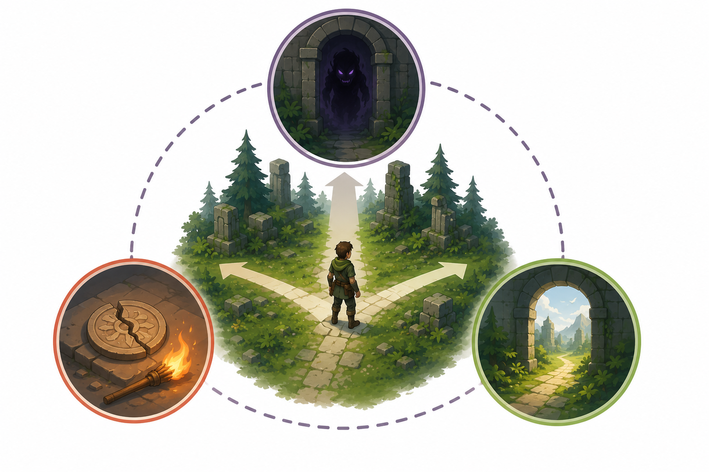

# Kapitel 4: Regler, resurser och begränsningar

## Varför detta kapitel finns

När en spelidé känns svag är det lätt att försöka lösa problemet genom att lägga till mer innehåll: fler fiender, fler banor, fler föremål eller fler berättelsedelar. Ibland hjälper det. Men ofta ligger problemet djupare: spelaren har för få intressanta val.

Det här kapitlet handlar om hur **regler**, **resurser** och **begränsningar** skapar val. Det kan låta torrt, men det är en av de mest praktiska delarna av speldesign. En bra regel kan göra en enkel handling meningsfull. En knapp resurs kan skapa spänning. En tydlig begränsning kan göra att spelaren måste tänka, prioritera och ta ansvar för sina beslut.

För en utvecklare är detta särskilt viktigt. Många enkla spelkopior fungerar tekniskt men saknar egen design eftersom reglerna bara återskapar originalets yta. När du förstår regler och resurser kan du börja förändra spel på ett mer medvetet sätt.

## Lärandemål

Efter kapitlet ska läsaren kunna:

- förklara hur regler formar vad spelaren kan, får och bör göra
- skilja mellan resurser som ger möjligheter och resurser som skapar press
- beskriva hur begränsningar kan göra val mer intressanta
- analysera enkla designval utifrån risk, kostnad och konsekvens
- modifiera en enkel spelidé genom att ändra regler, resurser eller begränsningar

## Innan vi börjar

I kapitel 1 beskrev vi speldesign som arbetet med mekaniker, regler, mål, feedback och upplevelse. I kapitel 2 såg vi hur mål ger riktning. I kapitel 3 såg vi hur kärnloopen binder samman handling, respons och belöning.

Nu går vi djupare in i vad som gör handlingar meningsfulla. En mekanik säger vad spelaren kan göra. En regel säger hur handlingen fungerar och vilka konsekvenser den får. En resurs säger vad spelaren har att använda, förlora eller spara. En begränsning säger vad spelaren inte kan göra fritt.

Tillsammans skapar de spelets beslut.

## Huvudförklaring

### Regler som designens osynliga struktur

En **regel** är en begränsande eller styrande princip som bestämmer hur spelet fungerar. Regler kan vara synliga för spelaren, som att “du får bara bära tre nycklar”. De kan också vara dolda eller indirekta, som att fiender hör ljud inom ett visst avstånd.

Regler gör tre saker:

1. De definierar vad som är möjligt.
2. De definierar vad som händer när spelaren agerar.
3. De formar vilka strategier som blir rimliga.

Tänk på Skogsruinen, vårt återkommande exempel. Grundidén är att spelaren utforskar en ruin i en skog. Mekaniken kan vara “öppna dörrar”. Men regeln avgör vad öppnandet betyder.

| Regel | Möjlig upplevelse |
|---|---|
| Alla dörrar öppnas direkt. | Utforskningen blir enkel och fri. |
| Vissa dörrar kräver nyckel. | Spelaren måste leta och minnas platser. |
| Nycklar förbrukas när de används. | Spelaren måste prioritera vilka dörrar som är viktigast. |
| Dörrar kan bara öppnas från ena sidan. | Världen får genvägar och rumslig struktur. |
| Vissa dörrar låter mycket när de öppnas. | Spelaren måste väga utforskning mot risk. |

Samma mekanik får alltså helt olika designfunktion beroende på reglerna.

Regler behöver inte vara många. Faktum är att få regler ofta är lättare att förstå och testa. Det viktiga är att reglerna skapar ett tydligt samband mellan spelarens beslut och spelets konsekvenser.

### Regler som tillåter, förbjuder och förändrar

Ett praktiskt sätt att analysera regler är att fråga vilken funktion de har. Många regler gör något av följande:

- De **tillåter** en handling: spelaren får hoppa, byta vapen eller tala med en figur.
- De **förbjuder** en handling: spelaren kan inte gå genom väggen eller bära obegränsat med föremål.
- De **kostar** något: handlingen kräver energi, ammunition, tid, pengar eller risk.
- De **förändrar** världen: en dörr öppnas, en fiende vaknar eller ett uppdrag uppdateras.
- De **prioriterar** vissa strategier: spelet gör vissa val smartare än andra.

En vanlig nybörjarmiss är att bara tänka på tillåtande regler: “spelaren kan göra X”. Men spel blir ofta intressanta när handlingar också har kostnader och konsekvenser.

Om spelaren kan hela sig när som helst utan kostnad blir skada mindre viktig. Om spelaren kan bära alla föremål blir val av utrustning mindre viktigt. Om spelaren kan göra om varje beslut utan följd blir risken lägre.

Det betyder inte att alla spel måste vara hårda eller straffande. Det betyder att varje frihet bör vara medveten.

### Resurser som möjligheter

En **resurs** är något spelaren kan använda, samla, spendera, skydda eller förlora. Resurser är viktiga eftersom de gör framtida handlingar beroende av tidigare beslut.

Vanliga resurser är:

- hälsa
- tid
- pengar
- ammunition
- energi
- kort
- byggmaterial
- information
- position
- uppmärksamhet
- förtroende från andra spelare eller figurer

Alla resurser är inte siffror. Information kan vara en resurs. Att veta var en hemlig dörr finns kan vara lika värdefullt som att ha en nyckel. Position kan vara en resurs i ett actionspel. Att stå högt, nära skydd eller nära målet kan ge möjligheter. Tid kan vara en resurs även när den inte visas som en timer.

En resurs kan skapa möjligheter. Om spelaren har en nyckel kan en dörr öppnas. Om spelaren har tillräckligt med energi kan en specialförmåga användas. Om spelaren har information kan en farlig väg undvikas.

Men resurser blir mest intressanta när de också skapar val.

### Resurser som press

En resurs skapar press när den är begränsad, osäker eller kopplad till risk. Då måste spelaren prioritera.

I Skogsruinen kan spelaren ha tre facklor. Varje fackla lyser upp mörka rum under en kort tid. Designen kan då skapa flera typer av beslut:

- Ska spelaren använda en fackla nu eller spara den?
- Är det mörka rummet värt risken?
- Finns det ledtrådar som antyder att facklor behövs senare?
- Kan spelaren hitta fler facklor, eller är mängden fast?

Samma resurs kan alltså skapa olika känslor beroende på reglerna runt den.

| Resursregel | Möjlig effekt |
|---|---|
| Facklor är vanliga. | Spelaren utforskar mer avslappnat. |
| Facklor är mycket sällsynta. | Varje mörkt rum blir ett svårt val. |
| Facklor slocknar snabbt. | Tempot blir stressigare. |
| Facklor lockar till sig fiender. | Resursen har både nytta och risk. |
| Facklor kan kastas för att distrahera. | Resursen får flera användningsområden. |

En bra resurs är inte bara något spelaren “har”. Den påverkar hur spelaren tänker.

### Begränsningar som skapar intressanta val

En **begränsning** är något som hindrar spelaren från att göra allt på en gång. Begränsningar kan kännas negativa, men i speldesign är de ofta nödvändiga. Utan begränsningar finns färre skäl att välja.

Några vanliga begränsningar är:

- begränsad tid
- begränsad rörelse
- begränsad synlighet
- begränsat lagerutrymme
- begränsat antal handlingar per tur
- begränsad information
- begränsad räckvidd
- begränsade sparpunkter
- begränsad kommunikation i multiplayer

Ett val blir intressant när spelaren har flera rimliga alternativ men inte kan välja alla. Om ett alternativ alltid är bäst är det inget verkligt val. Om spelaren saknar information helt blir valet slumpmässigt. Designerns uppgift är att skapa ett mellanläge: tillräckligt tydligt för att spelaren ska kunna resonera, men tillräckligt osäkert för att valet ska kännas levande.

Ett praktiskt test är att fråga:

- Vad ger det här valet spelaren?
- Vad kostar det?
- Vad riskerar spelaren?
- Vad måste spelaren avstå från?
- Hur får spelaren feedback på beslutet?

Om du inte kan svara på de frågorna kanske valet behöver tydligare regler eller konsekvenser.

### Kostnad, risk och konsekvens

Många bra designbeslut kan analyseras med tre ord: **kostnad**, **risk** och **konsekvens**.

**Kostnad** är vad spelaren betalar för en handling. Det kan vara ammunition, tid, hälsa, energi eller en framtida möjlighet.

**Risk** är vad som kan gå fel. Det kan vara att förlora en resurs, avslöja sin position, missa en chans eller hamna i ett svårare läge.

**Konsekvens** är vad som faktiskt förändras efter beslutet. En konsekvens kan vara omedelbar eller komma senare.

Exempel:

Spelaren i Skogsruinen hittar en tung stenport. Den kan öppnas genom att använda ett sigill.

- Kostnad: sigillet förbrukas.
- Risk: spelaren vet inte om det finns viktigare portar senare.
- Konsekvens: ett nytt område öppnas, men en annan väg kanske blir svårare.

Detta är mer intressant än en port som bara kräver att spelaren trycker på en knapp. Inte för att knappar är dåliga, utan för att sigillet kopplar porten till resurser, osäkerhet och framtida planering.

*Figur 4.1: Ett spelarval blir mer meningsfullt när det har kostnad, risk och konsekvens.*

### När begränsningar blir irritation

Begränsningar kan också misslyckas. En begränsning är inte automatiskt bra bara för att den gör spelet svårare.

En begränsning riskerar att bli irriterande när:

- spelaren inte förstår den
- den stoppar spelaren utan att skapa ett meningsfullt val
- den upprepas för ofta
- den straffar spelaren utan tydlig förvarning
- den tvingar spelaren att göra tråkigt administrativt arbete
- den går emot spelets huvudsakliga upplevelse

Ett lager med begränsat utrymme kan vara intressant i ett överlevnadsspel där planering är central. Samma lager kan kännas störande i ett snabbt actionspel där spelaren vill hålla tempo. En timer kan skapa spänning i en flyktsekvens men kännas stressande i ett spel som annars handlar om lugn utforskning.

Frågan är alltså inte “är begränsningen realistisk?” utan “stödjer begränsningen den upplevelse spelet försöker skapa?”

## Genreexempel

### Pusselspel

I pusselspel är regler ofta själva innehållet. Spelaren försöker förstå vad som gäller och använda reglerna på ett smart sätt. Resurser kan vara antal drag, tillgängliga objekt eller information.

Ett pussel blir ofta starkare när begränsningen är tydlig. Om spelaren bara får flytta en låda i taget, eller bara har tre speglar att placera ut, skapas ett avgränsat problem. För många regler på en gång kan däremot göra pusslet svårt att läsa.

Bra fråga för pusseldesign: Vilken regel ska spelaren upptäcka, förstå eller kombinera i detta pussel?

### Actionspel

I actionspel handlar regler ofta om rörelse, timing, träffytor, skada och risk. Resurser som hälsa, ammunition, stamina och position påverkar spelarens beslut i hög hastighet.

En begränsning i action behöver ofta kännas rättvis direkt. Om spelaren inte förstår varför en attack träffade eller missade kan frustrationen bli snabb. Därför är tydlig feedback extra viktig, även om kapitlet om feedback kommer senare.

Bra fråga för actiondesign: Kan spelaren förstå sambandet mellan risk, timing och resultat medan tempot är högt?

### Strategi- och simulationsspel

I strategi- och simulationsspel är resurser ofta centrala. Spelaren väger kortsiktiga behov mot långsiktig planering. Pengar, produktion, tid, territorium, arbetskraft och information kan alla fungera som resurser.

Begränsningar skapar strategisk identitet. Om allt kan byggas snabbt och billigt försvinner många beslut. Om varje investering däremot kräver avvägning uppstår planering.

Bra fråga för strategidesign: Vilka resurser konkurrerar med varandra, och hur gör de spelarens planering intressant?

### Rollspel

I rollspel kan resurser vara både mekaniska och berättelsemässiga. Hälsa, mana, utrustning och erfarenhetspoäng är tydliga resurser. Relationer, rykte, kunskap och moraliska val kan också fungera som resurser eller begränsningar.

Ett rollspel kan använda begränsningar för att ge karaktärsbyggen identitet. En magiker kan ha stor kraft men vara sårbar. En krigare kan tåla mycket men sakna vissa sociala eller magiska alternativ. Om alla karaktärer kan allt blir valen mindre tydliga.

Bra fråga för rollspelsdesign: Hur gör regler och begränsningar att spelarens valda roll faktiskt känns annorlunda?

## Exempel: Skogsruinen

Låt oss designa om Skogsruinen med fokus på regler, resurser och begränsningar.

Grundidé: Spelaren utforskar en ruin och försöker nå en förseglad kammare.

### Version A: Fri utforskning

- Spelaren kan öppna alla dörrar.
- Det finns inga resurser.
- Fiender undviks enkelt.
- Inga val låser eller påverkar framtiden.

Den här versionen kan fungera som en kort stämningsupplevelse, men den har få designmässiga beslut. Spelaren rör sig framåt och ser innehåll, men behöver inte prioritera.

### Version B: Nycklar och låsta dörrar

- Vissa dörrar kräver nyckel.
- Nycklar förbrukas inte.
- Spelaren måste minnas var låsta dörrar finns.

Nu får spelet mer struktur. Nycklar ger framsteg och dörrar skapar mål. Men när spelaren väl har en nyckel blir beslutet ganska enkelt: hitta dörren och öppna den.

### Version C: Förbrukade sigill

- Vissa portar kräver sigill.
- Sigill förbrukas när de används.
- Det finns färre sigill än portar.
- Varje port leder till olika typer av belöningar.

Nu uppstår prioritering. Spelaren måste fråga sig: “Vilken väg är viktigast?” Det kan skapa starkare engagemang, men också risk för frustration om informationen är för otydlig.

### Version D: Facklor i mörker

- Mörka rum kräver facklor för att utforskas säkert.
- Facklor är begränsade.
- Facklor kan också användas för att skrämma bort vissa fiender.
- När en fackla används till en fiende finns den inte kvar för utforskning.

Här får samma resurs två funktioner. Det skapar ett mer intressant val eftersom användningen i en situation påverkar framtida möjligheter.

Den centrala designfrågan blir då: Hur mycket information ska spelaren få innan beslutet? Om spelaren ser ledtrådar om att ett mörkt rum kan innehålla ett sigill känns valet mer strategiskt. Om spelaren inte får någon ledtråd alls kan valet kännas slumpmässigt.

## Vanliga misstag

- **Misstag: För många resurser för tidigt.**
  - Varför det händer: Designern vill skapa djup genom att lägga till många mätare, valutor och föremål.
  - Hur man undviker det: Börja med en eller två resurser och gör dem betydelsefulla innan du lägger till fler.

- **Misstag: Begränsningar utan designsyfte.**
  - Varför det händer: Designern kopierar en begränsning från en genre utan att fundera på upplevelsen.
  - Hur man undviker det: Formulera vad begränsningen ska få spelaren att tänka, känna eller göra.

- **Misstag: Val utan konsekvens.**
  - Varför det händer: Spelet erbjuder flera alternativ, men de leder till samma resultat.
  - Hur man undviker det: Ge varje alternativ en tydlig skillnad i kostnad, risk eller framtida möjlighet.

- **Misstag: Kostnader som bara bromsar spelet.**
  - Varför det händer: Designern vill skapa utmaning men lägger till väntan, grindning eller administration.
  - Hur man undviker det: Kontrollera om kostnaden skapar ett beslut eller bara fördröjer spelaren.

- **Misstag: Dolda regler som känns orättvisa.**
  - Varför det händer: Designern vill skapa överraskning eller komplexitet.
  - Hur man undviker det: Låt spelaren kunna läsa situationen genom ledtrådar, feedback eller tidigare mönster.

## Designworkshop

### Övning 1: Gör en mekanik mer meningsfull

Välj en enkel mekanik från ett spel du känner till, till exempel hoppa, skjuta, samla, bygga, prata eller öppna dörrar.

Besvara:

1. Vad kan spelaren göra?
2. Vilken regel styr handlingen?
3. Vilken kostnad finns?
4. Vilken risk finns?
5. Vilken konsekvens finns?
6. Hur skulle handlingen förändras om en resurs kopplades till den?

Målet är inte att göra mekaniken mer komplicerad. Målet är att göra den mer meningsfull.

### Övning 2: Skapa en resurs med två användningar

Designa en resurs för Skogsruinen eller ett eget spel. Resursen ska kunna användas på minst två sätt.

Exempel: En fackla kan lysa upp rum eller skrämma bort fiender.

Besvara:

1. Vad heter resursen?
2. Hur får spelaren tag på den?
3. Vad kan den användas till?
4. Vad händer när den tar slut?
5. Vilket intressant val skapar den?

### Övning 3: Ta bort en begränsning

Välj ett spel du känner till och identifiera en viktig begränsning. Föreställ dig sedan att begränsningen tas bort.

Exempel:

- obegränsad ammunition
- obegränsat lagerutrymme
- ingen tidsgräns
- fri teleportering
- alla dörrar är öppna från början

Besvara:

1. Vad blir enklare?
2. Vad blir mindre intressant?
3. Vilken del av spelets upplevelse förändras mest?
4. Skulle spelet bli bättre, sämre eller bara annorlunda?

## Snabb sammanfattning

- Regler formar vad spelaren kan göra och vilka konsekvenser handlingar får.
- Resurser gör framtida möjligheter beroende av tidigare beslut.
- Begränsningar skapar val genom att hindra spelaren från att göra allt samtidigt.
- Intressanta val behöver kostnad, risk eller konsekvens.
- En begränsning är bara bra om den stödjer den upplevelse spelet försöker skapa.
- Genrer använder regler och resurser på olika sätt, men principen är densamma: spelaren behöver förstå vad valet betyder.

## Quiz/reflektionsfrågor

1. Vad är skillnaden mellan en mekanik och en regel?
2. Ge ett exempel på en resurs som inte är en siffra.
3. Varför kan en begränsning göra ett spel mer intressant?
4. När riskerar en begränsning att bli irriterande?
5. Hur kan samma resurs skapa två olika typer av beslut?
6. Välj ett spel du gillar. Vilken regel gör spelets viktigaste val möjligt?

## Nästa steg

I nästa kapitel går vi vidare till **feedback och spelkänsla**. Där undersöker vi hur spelet visar, låter och känns när reglerna aktiveras. Regler, resurser och begränsningar skapar beslut, men feedback hjälper spelaren att förstå beslutens resultat.
