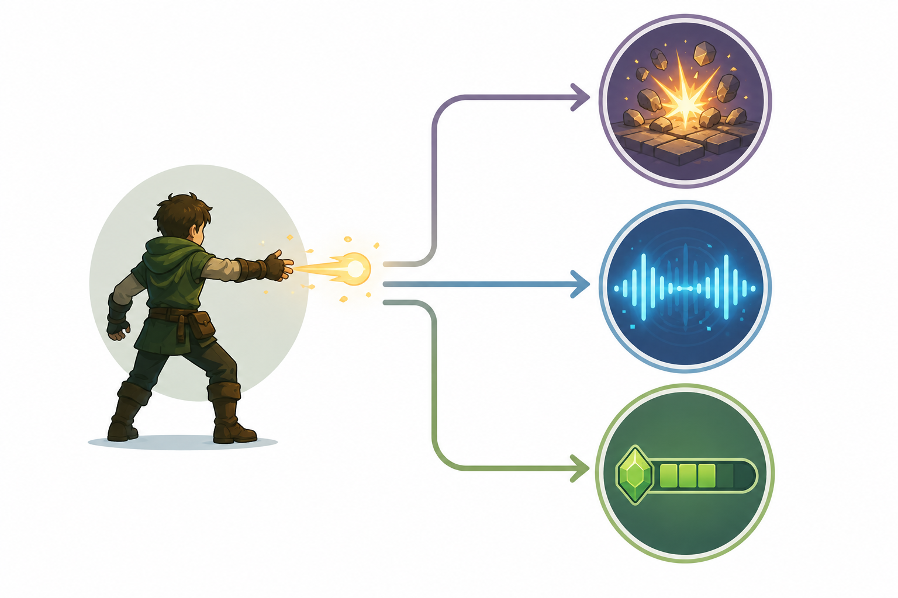

# Kapitel 5: Feedback och spelkänsla

## Varför detta kapitel finns

Ett spel kan ha tydliga mål, smarta regler och en fungerande kärnloop, men ändå kännas svagt. Spelaren kanske inte förstår vad som händer. En träff kanske inte känns som en träff. Ett misstag kanske upplevs som slumpmässigt. En knapptryckning kanske tekniskt fungerar, men känns seg, oprecis eller ointressant.

Det här kapitlet handlar om **feedback** och **spelkänsla**. Feedback är spelets sätt att svara på spelarens handlingar och situationer. Spelkänsla är hur kontroll, respons, tempo, ljud, rörelse och tydlighet tillsammans får spelet att kännas i händerna och i huvudet.

För en utvecklare som byggt kopior av enkla spel är detta ofta ett avgörande steg. Kopian kan ha samma regler som originalet men ändå sakna samma kraft. Skillnaden ligger ofta inte i den övergripande idén, utan i hur spelet svarar: hur snabbt, hur tydligt, hur ofta och med vilken känsla.

## Lärandemål

Efter kapitlet ska läsaren kunna:

- förklara vad feedback är och varför den är central i speldesign
- skilja mellan informativ, emotionell och korrigerande feedback
- beskriva hur spelkänsla uppstår genom kontroll, respons och presentation
- analysera varför en handling kan kännas tydlig, svag, tung, snabb eller orättvis
- förbättra en enkel spelidé genom att lägga till bättre feedback utan att ändra kärnreglerna

## Innan vi börjar

I kapitel 3 beskrev vi kärnloopen som en återkommande cykel av handling, respons och belöning. Feedback är den del av responsen som spelaren faktiskt kan uppfatta och tolka.

I kapitel 4 såg vi att regler, resurser och begränsningar skapar meningsfulla val. Men regler hjälper inte om spelaren inte märker deras konsekvenser. Om spelaren förlorar hälsa utan att förstå varför, känns regeln inte som design utan som godtycke. Om en resurs ökar utan att spelet visar att den ökade, tappar belöningen kraft. Om en begränsning stoppar spelaren utan förklaring, känns den lätt som ett tekniskt fel.

Feedback gör designen läsbar.

## Huvudförklaring

### Feedback är spelets svar

**Feedback** är all information spelet ger spelaren som svar på en handling, ett tillstånd eller en förändring. Feedback kan vara visuell, auditiv, taktil, rumslig, systemisk eller narrativ.

När spelaren öppnar en dörr kan spelet ge feedback på många sätt:

- Dörren rör sig.
- Ett ljud hörs.
- Kameran skakar lätt.
- En ikon försvinner från inventariet.
- En text säger att nyckeln användes.
- Ett nytt område blir synligt.
- Musikens intensitet förändras.
- En fiende längre bort reagerar på ljudet.

Alla dessa svar berättar något. Vissa säger att handlingen lyckades. Andra säger vad handlingen kostade. Några säger att världen förändrades. Bra feedback hjälper spelaren att förstå sambandet mellan beslut och konsekvens.

Dålig feedback gör motsatsen. Den kan göra ett fungerande system otydligt, göra en rättvis regel orättvis i spelarens ögon eller få en kraftfull handling att kännas svag.

### Tre funktioner hos feedback

Ett praktiskt sätt att tänka på feedback är att skilja mellan tre funktioner: informativ, emotionell och korrigerande feedback.

| Funktion | Fråga den besvarar | Exempel |
|---|---|---|
| Informativ feedback | Vad hände? | Hälsomätaren minskar när spelaren träffas. |
| Emotionell feedback | Hur ska det kännas? | En tung smäll, kort kameraskakning och kraftigt ljud gör träffen dramatisk. |
| Korrigerande feedback | Vad bör spelaren göra annorlunda? | En fiende blinkar före attack så spelaren hinner reagera nästa gång. |

Samma händelse kan använda alla tre. Om spelaren går in i giftig dimma kan spelet visa en grön skadaeffekt, spela ett fräsande ljud, minska hälsan och låta figuren hosta. Informativt säger spelet att hälsa förloras. Emotionellt säger det att platsen är obehaglig och farlig. Korrigerande säger det att spelaren bör lämna området eller hitta skydd.

En vanlig nybörjarmiss är att bara lägga till informativ feedback: siffror, mätare och text. Det kan vara nödvändigt, men ofta räcker det inte. Spelaren behöver också känna att något händer och förstå vad nästa rimliga beslut är.

*Figur 5.1: Feedback hjälper spelaren att förstå vad som hände, hur det känns och vad nästa beslut kan vara.*

### Feedback måste komma i rätt tid

Feedbackens timing är nästan lika viktig som feedbackens innehåll. Om spelaren trycker på en knapp och spelet svarar direkt känns kontrollen nära. Om svaret kommer för sent kan samma mekanik kännas trög, även om regeln är korrekt.

Det betyder inte att all feedback måste vara omedelbar. I vissa spel är fördröjning en del av designen. Ett tungt svärd kan ha lång uppsvingning. En strategisk order kan ta tid att utföra. Ett beslut i ett rollspel kan få konsekvenser först senare.

Skillnaden är om fördröjningen är begriplig och avsiktlig.

I ett actionspel behöver spelaren ofta snabb feedback eftersom nästa beslut kommer omedelbart. I ett strategispel kan feedback vara långsammare, men den måste fortfarande visa orsak och verkan. I ett pusselspel kan fördröjd feedback användas för att skapa eftertanke, men spelaren behöver kunna förstå vilken regel som aktiverades.

Frågan är alltså inte bara “hur snabbt svarar spelet?” utan “passar svarstiden den upplevelse spelet försöker skapa?”

### Spelkänsla är mer än grafik

**Spelkänsla** är den upplevda kvaliteten i att styra, påverka och läsa spelet. Det är ett samspel mellan många små designbeslut:

- hur snabbt figuren reagerar på input
- hur rörelse accelererar och bromsar
- hur tydligt träffar, hopp, landningar och kollisioner markeras
- hur ljud och animation förstärker handlingar
- hur kameran följer eller motarbetar spelaren
- hur konsekvent spelets regler känns
- hur lätt spelaren kan förutsäga resultatet av en handling

Spelkänsla är inte samma sak som att spelet är lätt. Ett svårt spel kan ha utmärkt spelkänsla om spelaren upplever att kontrollen är tydlig och att misslyckanden går att förstå. Ett enkelt spel kan ha dålig spelkänsla om allt känns flytande, otydligt eller frikopplat från spelarens handlingar.

För utvecklare är det viktigt att inte avfärda spelkänsla som “polish” i slutet. I praktiken påverkar spelkänsla hur själva reglerna uppfattas. En hoppmekanik med dålig kontroll kan få en bana att kännas orättvis. En attack utan tydlig träffrespons kan få stridssystemet att kännas slumpmässigt. En resurs som samlas in utan ljud, rörelse eller markering kan kännas oviktig.

### Exempel: Skogsruinen och den tunga dörren

I Skogsruinen hittar spelaren en gammal stendörr. Regeln är enkel: dörren kan öppnas om spelaren har ett sigill. Resursen är sigillet. Begränsningen är att sigillet förbrukas.

Utan feedback kan händelsen beskrivas så här:

1. Spelaren trycker på använd-knappen.
2. Dörren öppnas.
3. Antalet sigill minskar med ett.

Det fungerar, men det kan kännas platt. Spelaren kanske inte märker att sigillet förbrukades eller varför dörren var viktig.

Med mer genomtänkt feedback kan samma regel kännas annorlunda:

1. När spelaren närmar sig dörren pulserar sigillmärket svagt.
2. Vid knapptryckning hörs ett dovt stenljud.
3. Sigillet i gränssnittet lyser upp och spricker.
4. Dörren rör sig långsamt, med damm och vibration.
5. Bakom dörren syns ett nytt område med annorlunda ljus.
6. Musiken går från låg spänning till nyfikenhet.

Regeln är densamma, men spelarens tolkning förändras. Dörren känns gammal, sigillet känns värdefullt och beslutet känns mer betydelsefullt.

Det viktiga är inte mängden effekter. Det viktiga är att feedbacken stödjer designens avsikt. Om dörren ska kännas mystisk behövs annan feedback än om den ska kännas farlig, komisk eller rutinmässig.

## Genreexempel

### Pusselspel: feedback som förklarar regler

I pusselspel är feedback ofta ett verktyg för inlärning. Spelaren experimenterar, ser vad som händer och bygger en mental modell av reglerna.

Om en knapp öppnar en dörr behöver spelaren förstå sambandet. Det kan ske genom en linje i miljön, ett ljud, en animation eller kamerafokus. Om flera objekt påverkas samtidigt måste spelet hjälpa spelaren att se mönstret.

Pusselspel behöver ofta tydlig korrigerande feedback. När spelaren gör fel bör spelet visa vad som blev fel utan att alltid ge lösningen. Det kan vara skillnaden mellan frustration och nyfikenhet.

### Actionspel: feedback som tempo och precision

I actionspel är feedback nära kopplad till tempo. Spelaren behöver snabbt veta om ett skott träffade, om en attack var farlig, om en undanmanöver lyckades och om nästa handling är möjlig.

Här blir små detaljer viktiga: träffljud, animation, fiendereaktion, korta pauser, kamerarörelse och tydliga varningssignaler. Om feedbacken är svag kan spelaren känna att spelet saknar kraft. Om feedbacken är otydlig kan spelaren känna att spelet är orättvist.

Actionspel kräver ofta stark koppling mellan input och respons. När spelaren trycker, siktar, hoppar eller attackerar måste spelet kännas förutsägbart även när det är svårt.

### Strategi- och simulationsspel: feedback som överblick

I strategi- och simulationsspel är feedback ofta mer systemisk. Spelaren fattar beslut som påverkar ekonomi, produktion, relationer, karta eller långsiktig utveckling. Feedbacken behöver därför hjälpa spelaren att förstå komplexitet.

Här kan bra feedback vara grafer, färgkodning, varningar, prognoser, jämförelser och tydliga sammanfattningar. En enskild animation är mindre viktig än att spelaren förstår systemets tillstånd.

Men även strategi behöver känsla. När en plan lyckas bör spelet visa det. När ett beslut får långsamma konsekvenser bör spelaren kunna följa kedjan. Annars känns systemet som en svart låda.

### Rollspel: feedback som identitet och konsekvens

I rollspel handlar feedback ofta om att val ska kännas som uttryck för spelarens roll. Om spelaren väljer att vara diplomatisk, aggressiv, listig eller hjälpsam behöver spelet svara på ett sätt som bekräftar att valet betyder något.

Feedbacken kan vara dialog, reaktioner från andra figurer, förändrade relationer, nya möjligheter eller långsiktiga konsekvenser. Rollspel kan också använda emotionell feedback starkt: musik, tonfall, miljöförändringar och berättelsens riktning.

Risken är att feedbacken blir för vag. Om spelaren gör ett val men inte märker någon skillnad kan valet kännas kosmetiskt. Om konsekvensen kommer långt senare behöver spelet ibland påminna spelaren om sambandet.

## Vanliga misstag

### Misstag 1: Feedback läggs till för sent

Det är vanligt att bygga regler och mekaniker först och tänka att feedback kan läggas på i slutet. Problemet är att feedback påverkar hur mekaniken uppfattas. Om du testar en mekanik utan rimlig feedback kan du dra fel slutsats om den.

Hur man undviker det: Lägg in enkel feedback tidigt. Den behöver inte vara vacker, men den ska visa vad som händer, varför det händer och vad spelaren kan göra härnäst.

### Misstag 2: All feedback är lika stark

Om allt blinkar, låter och skakar hela tiden blir inget viktigt. För mycket feedback kan göra spelet svårläst.

Hur man undviker det: Skapa hierarki. Viktiga händelser ska ha starkare feedback än rutinhandlingar. Fara ska skilja sig från belöning. Permanent förändring ska kännas annorlunda än tillfällig information.

### Misstag 3: Spelet visar resultat men inte orsak

Spelaren ser att hälsan minskar, men inte varför. Spelaren ser att en resurs försvinner, men inte vad som förbrukade den. Spelaren misslyckas, men förstår inte vilken regel som aktiverades.

Hur man undviker det: Koppla feedback till orsakskedjan. Visa inte bara slutresultatet. Visa handlingen, reaktionen och konsekvensen.

### Misstag 4: Spelkänsla reduceras till effekter

Partiklar, ljud och kameraskakning kan förstärka känsla, men de kan inte rädda en kontroll som känns oprecis eller regler som är svåra att läsa.

Hur man undviker det: Börja med relationen mellan input, rörelse, respons och konsekvens. Lägg sedan till presentation som förstärker den relationen.

## Designworkshop: förbättra feedbacken i en enkel scen

Välj en enkel scen från ett spel du byggt eller kopierat. Det kan vara ett hopp, en träff, en dörr, en insamlad resurs eller ett misslyckande.

Svara på följande frågor:

1. Vilken handling utför spelaren?
2. Vilken regel aktiveras?
3. Vilken konsekvens får handlingen?
4. Hur märker spelaren att handlingen lyckades eller misslyckades?
5. Vilken feedback är informativ?
6. Vilken feedback är emotionell?
7. Vilken feedback hjälper spelaren att göra bättre nästa gång?
8. Är någon feedback för svag, för sen eller för stark?

Gör sedan en förbättring som inte ändrar huvudregeln. Exempel:

- Lägg till ett tydligare ljud.
- Förtydliga animationen.
- Visa kostnaden i gränssnittet.
- Låt objektet reagera på spelarens handling.
- Ge en kort varning innan fara.
- Skapa en tydligare skillnad mellan liten och stor belöning.

Målet är att se hur mycket upplevelsen kan förändras utan att spelets grundsystem ändras.

## Övningar

### Övning 1: Feedbackinventering

Välj ett spel du känner väl. Skriv ner fem återkommande handlingar och vilken feedback spelet ger på dem.

För varje handling, markera om feedbacken främst är:

- informativ
- emotionell
- korrigerande
- en kombination

Avsluta med att beskriva vilken handling som har bäst feedback och varför.

### Övning 2: Gör en svag handling tydligare

Föreställ dig att Skogsruinen har en enkel mekanik där spelaren samlar ljusfragment. Just nu försvinner fragmentet bara när spelaren går över det.

Designa tre olika feedbackvarianter:

1. En som gör fragmentet mystiskt.
2. En som gör fragmentet värdefullt.
3. En som gör fragmentet farligt eller riskabelt.

Beskriv vilka ljud, rörelser, färger, gränssnittssignaler eller systemkonsekvenser du skulle använda.

### Övning 3: Orsak och konsekvens

Skriv en kort orsakskedja för en händelse i ett spel:

1. Spelaren gör något.
2. Spelet tolkar handlingen.
3. En regel aktiveras.
4. Ett tillstånd förändras.
5. Spelet ger feedback.
6. Spelaren fattar nästa beslut.

Analysera var kedjan riskerar att bli otydlig.

### Fördjupning

Ta en enkel spelkopia du tidigare gjort. Välj en central handling, till exempel hopp, skott, blockering, matchning eller insamling. Förbättra bara feedbacken under en kort iteration. Ändra inte reglerna.

Testa sedan handlingen före och efter. Skriv ner om handlingen känns mer begriplig, mer kraftfull, mer rättvis eller mer motiverande.

## Snabb sammanfattning

- Feedback är spelets svar på spelarens handlingar, tillstånd och förändringar.
- Bra feedback gör regler, resurser och konsekvenser begripliga.
- Feedback kan vara informativ, emotionell och korrigerande.
- Timing påverkar hur kontroll och rättvisa upplevs.
- Spelkänsla uppstår genom samspelet mellan input, respons, presentation och förutsägbarhet.
- Olika genrer använder feedback på olika sätt: pussel lär ut regler, action stödjer precision, strategi ger överblick och rollspel visar konsekvens.
- Feedback bör testas tidigt, inte bara läggas till som polish i slutet.

## Quiz/reflektionsfrågor

1. Vad är skillnaden mellan feedback och belöning?
2. Varför kan en rättvis regel ändå kännas orättvis om feedbacken är dålig?
3. Ge ett exempel på informativ feedback och ett exempel på emotionell feedback.
4. Hur kan fördröjd feedback vara bra i vissa genrer men problematisk i andra?
5. Vad menas med spelkänsla?
6. Vilken feedback skulle du lägga till i Skogsruinen för att visa att ett sigill har förbrukats?

## Nästa steg

Nu har vi gått igenom mål, motivation, kärnloopar, regler, resurser, begränsningar och feedback. Nästa kapitel handlar om **balans och svårighetsgrad**. Där undersöker vi hur man justerar ett spel så att det blir utmanande, rättvist och intressant över tid.
