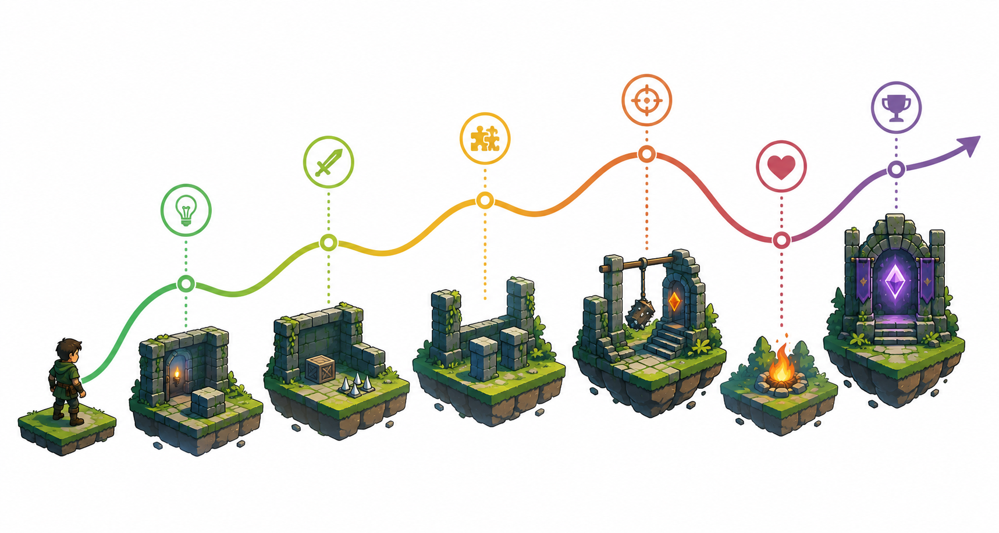

# Kapitel 6: Balans och svårighetsgrad

## Varför detta kapitel finns

Ett spel kan vara tydligt, responsivt och byggt på intressanta regler, men ändå misslyckas om utmaningen hamnar fel. Om spelet är för lätt blir spelarens beslut betydelselösa. Om det är för svårt blir spelaren frustrerad eller misstänker att designen är orättvis. Om svårigheten varierar slumpmässigt kan spelaren tappa förtroendet för spelet.

Det här kapitlet handlar om **balans** och **svårighetsgrad**. Balans betyder inte att allt ska vara jämnt, snällt eller perfekt symmetriskt. Balans handlar om att justera regler, resurser, risker och belöningar så att spelet skapar den typ av upplevelse som designen är ute efter.

För en utvecklare är balans lätt att missförstå som en ren sifferfråga: mer hälsa, mindre skada, snabbare fiender, längre timer. Siffror spelar roll, men de är bara en del av bilden. Balans handlar också om information, kontroll, tempo, förlåtelse, variation och spelarens möjlighet att lära sig.

## Lärandemål

Efter kapitlet ska läsaren kunna:

- förklara vad balans betyder i speldesign
- skilja mellan svårighet, rättvisa och frustration
- beskriva hur en svårighetskurva påverkar spelarens lärande
- analysera tolerans, marginaler och förlåtelse i en utmaning
- justera en enkel spelutmaning utan att ta bort dess kärna

## Innan vi börjar

I kapitel 4 såg vi att regler, resurser och begränsningar skapar val. I kapitel 5 såg vi att feedback gör dessa val begripliga. Balans uppstår i samspelet mellan dessa delar.

En fälla i Skogsruinen är inte bara balanserad genom hur mycket skada den gör. Den påverkas också av:

- hur tidigt spelaren ser den
- hur tydligt den varnas genom feedback
- hur lätt den är att undvika
- hur ofta den upprepas
- vilken resurs spelaren förlorar
- hur långt tillbaka spelaren skickas vid misslyckande
- vad spelaren kan lära sig till nästa försök

Balans är därför inte en separat fas efter designen. Den är en löpande fråga: vad kräver spelet av spelaren, vad ger det tillbaka och hur rimligt känns sambandet?

## Huvudförklaring

### Balans är upplevd rimlighet

**Balans** är arbetet med att justera ett spels regler, resurser, risker, belöningar och tempo så att upplevelsen blir intressant, begriplig och rimlig.

Det viktiga ordet är *upplevelsen*. Ett system kan vara matematiskt jämnt men ändå kännas dåligt. Ett annat system kan vara avsiktligt ojämnt men kännas spännande. I ett skräckspel kan spelaren vara svagare än hotet. I ett strategispel kan vissa val vara starka i början men svaga senare. I ett rollspel kan en fiende vara omöjlig första gången och hanterbar efter att spelaren lärt sig systemet.

Balans handlar alltså inte alltid om lika villkor. Det handlar om att spelets villkor stödjer den tänkta upplevelsen.

I Skogsruinen kan en tung stendörr kräva tre sigill för att öppnas. Det kan vara balanserat om spelaren förstår varför sigill är viktiga, får rimliga möjligheter att samla dem och ställs inför intressanta val om när de ska användas. Samma regel blir obalanserad om sigill dyker upp slumpmässigt, om spelaren inte får veta hur många som behövs eller om fel beslut tvingar spelaren att börja om utan lärdom.

### Svårighet är inte samma sak som frustration

**Svårighetsgrad** beskriver hur mycket spelet kräver av spelaren. Kraven kan handla om reaktion, planering, minne, precision, tolkning, uthållighet eller social förmåga.

**Frustration** uppstår när spelaren upplever att misslyckandet inte är meningsfullt. Det kan bero på att spelet är för svårt, men också på att det är otydligt, långsamt, slumpmässigt eller straffande på fel sätt.

En utmaning kan vara svår men rättvis om spelaren tänker:

- Jag förstår vad som hände.
- Jag kunde ha gjort något annorlunda.
- Jag vill försöka igen.
- Jag lärde mig något.

En utmaning känns ofta frustrerande om spelaren tänker:

- Jag förstod inte varför jag misslyckades.
- Spelet lurade mig utan varning.
- Min kontroll fungerade inte som jag trodde.
- Jag måste upprepa tråkiga moment för att få ett nytt försök.
- Resultatet kändes slumpmässigt.

Det betyder att feedback, kontroll och återstartstid är en del av svårighetsdesignen. Ett spel kan bli mindre frustrerande utan att bli lättare, bara genom att göra misslyckandet tydligare och vägen tillbaka kortare.

### Svårighetskurvan visar hur kraven förändras

En **svårighetskurva** beskriver hur spelets krav ökar, minskar eller varierar över tid. En vanlig nybörjartanke är att svårigheten bör öka jämnt hela tiden. I praktiken fungerar det sällan så enkelt.

En bra svårighetskurva har ofta variation:

- lugna partier där spelaren får förstå ett nytt begrepp
- gradvis ökande krav där spelaren får öva
- toppar där kunskapen testas
- lättare partier efter svåra moment
- nya kombinationer av tidigare lärda regler

Tänk på Skogsruinen. Om varje rum är svårare än det förra utan paus blir spelaren trött. Om varje rum är ungefär lika svårt kan spelet kännas monotont. Om svårigheten däremot växlar mellan introduktion, övning, kombination och prövning kan spelaren känna progression.

En enkel modell är:

| Fas | Syfte | Exempel i Skogsruinen |
|---|---|---|
| Introducera | Visa en regel i trygg miljö | Spelaren ser en fälla utan att hotas direkt. |
| Öva | Låt spelaren använda regeln | Spelaren passerar en långsam fälla med tydlig rytm. |
| Kombinera | Koppla regeln till andra system | Fällan kombineras med begränsat ljus. |
| Pröva | Testa spelarens förståelse | Spelaren måste välja rätt väg under tidspress. |
| Vila | Ge återhämtning och tolkning | Ett säkert rum med belöning och ledtråd. |

Den här modellen är inte bara användbar för actionspel. Den fungerar även för pussel, strategi, rollspel och undervisande spel.

*Figur 6.1: En svårighetskurva behöver rytm, inte bara ständig ökning.*

### Tolerans och marginaler formar upplevelsen

**Tolerans** handlar om hur mycket fel spelet tillåter innan spelaren misslyckas. Tolerans kan finnas i tid, position, resurser, information eller konsekvenser.

I ett plattformsspel kan tolerans vara att spelaren får hoppa någon bildruta efter att ha lämnat kanten. I ett pusselspel kan tolerans vara att spelet låter spelaren ångra ett drag. I ett strategispel kan tolerans vara att ett dåligt beslut inte förstör hela matchen direkt. I ett rollspel kan tolerans vara att en misslyckad dialog inte stänger alla vägar framåt.

Tolerans gör inte automatiskt spelet lätt. Den kan tvärtom göra spelet bättre på att mäta rätt förmåga. Om ett spel ska testa planering bör det inte straffa små klickfel hårdare än dåliga planer. Om ett spel ska testa reaktion bör det inte samtidigt kräva att spelaren gissar osynliga regler.

Frågan är därför: vilken färdighet vill utmaningen testa?

Om Skogsruinen har en fälla som ska testa observation, bör spelaren få se små sprickor i golvet eller höra ett mekaniskt ljud. Om fällan ska testa reaktion, behöver varningen komma nära inpå men vara tydlig. Om fällan ska testa resurshantering, kan spelaren få välja att spendera ett sigill för att desarmera den.

### Belöning och risk måste tala samma språk

Balans handlar inte bara om hur svårt något är, utan också om vad spelaren får för risken. Om en farlig sidokorridor bara ger en obetydlig belöning känns den meningslös. Om en lätt handling ger enorm belöning kan andra val bli ointressanta.

En användbar fråga är: *varför skulle spelaren välja detta?*

Risk och belöning kan balanseras på flera sätt:

- hög risk och hög belöning
- låg risk och låg belöning
- hög kostnad men långsiktig nytta
- säker väg med långsam progression
- farlig väg med snabb progression
- val som ger information snarare än resurser

I Skogsruinen kan spelaren välja mellan två vägar. Den ljusa korridoren är längre men säker. Den mörka korridoren är kortare men kräver facklor och har fällor. Om båda leder till samma belöning på samma tid blir valet svagt. Om den mörka vägen ger extra sigill, en genväg eller viktig kunskap blir valet mer meningsfullt.

### Balans är också variation

Ett vanligt problem i enkla prototyper är att allt balanseras mot ett medelvärde. Fiender får ungefär samma hälsa. Rum tar ungefär lika lång tid. Belöningar är ungefär lika stora. Resultatet kan bli tekniskt jämnt men upplevelsemässigt platt.

Variation hjälper spelaren att känna skillnad mellan situationer. Men variation behöver struktur. Om allt varierar hela tiden blir spelet svårt att läsa.

Ett bra sätt är att bestämma vad som ska vara stabilt och vad som får variera.

| Stabilt | Varierande |
|---|---|
| Grundregler | Kombinationer av regler |
| Kontroll | Miljöer och hinder |
| Tydlig feedback | Intensitet och tempo |
| Spelarens mål | Vägar till målet |
| Konsekvenslogik | Risknivå och belöning |

I Skogsruinen bör spelaren alltid kunna lita på att facklor ger ljus, att sigill används för lås och att fällor går att läsa. Men rummen kan variera i layout, risk, tempo och belöning.

## Exempel: Skogsruinen balanseras

Anta att Skogsruinen har ett rum med tre golvfällor, en låst dörr och ett ljusfragment. Den första versionen ser ut så här:

- Fällorna syns inte förrän de aktiveras.
- Spelaren dör direkt vid träff.
- Startpunkten ligger två minuter bakåt.
- Ljusfragmentet ger bara poäng.
- Dörren kräver två sigill, men spelet säger inte det förrän spelaren försöker öppna den.

Det här kan vara svårt, men framför allt är det otydligt och hårt. Spelaren kan misslyckas utan att förstå varför och måste upprepa mycket.

En balanserad version kan behålla faran men ändra marginalerna:

- Fällorna har små visuella ledtrådar.
- Första träffen skadar spelaren men dödar inte.
- Startpunkten ligger nära rummet.
- Ljusfragmentet avslöjar fällornas rytm några sekunder.
- Dörren visar två tomma sigillplatser redan när spelaren ser den.
- En säker nisch låter spelaren observera fällorna innan försöket.

Kärnan är fortfarande densamma: spelaren ska läsa rummet, hantera risk och använda resurser. Men nu kan spelaren förstå, lära och försöka igen.

## Genreöversikt: balans i olika speltyper

### Pusselspel

I pusselspel handlar balans ofta om informationsmängd och lösningsrymd. Ett pussel blir frustrerande när spelaren inte vet vilka regler som gäller eller när lösningen kräver ett tankehopp som inte förberetts. Bra balans innebär tydliga regler, begränsad men intressant lösningsrymd och ledtrådar som hjälper utan att lösa åt spelaren.

### Actionspel

I actionspel handlar balans ofta om timing, kontroll, läsbarhet och återstart. En svår fiende kan vara rättvis om attackerna är tydliga, kontrollen är konsekvent och spelaren snabbt får försöka igen. Små justeringar i hastighet, träffytor och förvarning kan förändra upplevelsen kraftigt.

### Strategi- och simulationsspel

I strategispel handlar balans ofta om valens relativa värde. Om en strategi alltid är bäst dör spelets beslutsrymd. Om slumpen dominerar tappar planering betydelse. Bra balans gör att olika strategier fungerar i olika sammanhang och att spelaren kan förstå varför ett beslut lyckades eller misslyckades.

### Rollspel

I rollspel handlar balans ofta om progression, valfrihet och identitet. Spelaren behöver känna att karaktären växer, men inte så snabbt att utmaningen försvinner. Val mellan färdigheter, utrustning och berättelsevägar bör skapa olika spelstilar snarare än ett enda uppenbart rätt svar.

### Multiplayer

I multiplayer blir balans extra känslig eftersom spelare jämför sig med varandra. Orättvisa kan upplevas starkare när en annan människa tjänar på den. Samtidigt behöver inte allt vara symmetriskt. Asymmetrisk balans kan fungera om rollerna är tydliga, motspel finns och spelarna accepterar villkoren.

## Vanliga misstag

- **Misstag: Att balansera genom att bara ändra siffror.**
  - Varför det händer: Siffror är lätta att justera och mäta.
  - Hur man undviker det: Undersök även information, feedback, återstart, kontroll och valstruktur.

- **Misstag: Att göra spelet lättare när problemet egentligen är otydlighet.**
  - Varför det händer: Spelartestare säger ofta att något är svårt även när de menar att det är obegripligt.
  - Hur man undviker det: Fråga vad spelaren förstod, inte bara om momentet var svårt.

- **Misstag: Att ta bort all frustration.**
  - Varför det händer: Man vill göra spelet mer tillgängligt.
  - Hur man undviker det: Skilj mellan produktiv spänning och meningslös irritation.

- **Misstag: Att jämna ut all variation.**
  - Varför det händer: Man försöker skapa rättvisa.
  - Hur man undviker det: Låt vissa delar variera, men håll grundregler och feedback konsekventa.

- **Misstag: Att balansera för sig själv.**
  - Varför det händer: Designern kan spelet för väl.
  - Hur man undviker det: Testa med personer som inte kan systemet och observera vad de missförstår.

## Designworkshop: gör en utmaning rättvisare

Välj en enkel utmaning: en fiende, ett pusselrum, en resursbrist eller en tidspressad passage.

Gå igenom följande frågor:

1. Vad ska utmaningen egentligen testa?
2. Vad får spelaren veta innan beslutet?
3. Vad händer vid misslyckande?
4. Hur snabbt kan spelaren försöka igen?
5. Vilken del är svår: förståelse, kontroll, timing, planering eller uthållighet?
6. Vilken marginal finns för små misstag?
7. Vilken belöning motiverar risken?
8. Vad kan justeras utan att utmaningens kärna försvinner?

Skriv sedan två versioner:

- en hårdare version som fortfarande är rättvis
- en mildare version som fortfarande är intressant

## Övningar

### Övning 1: Svår men rättvis

Välj ett svårt moment i ett spel du känner till. Beskriv varför det känns rättvist eller orättvist.

Använd dessa rubriker:

- Vad kräver momentet av spelaren?
- Vilken information ges före beslutet?
- Vilken feedback ges vid misslyckande?
- Vad lär sig spelaren?
- Vad skulle du justera?

### Övning 2: Justera Skogsruinen

Designa ett rum i Skogsruinen med en fälla, en belöning och en alternativ väg.

Skapa tre varianter:

1. För lätt.
2. För frustrerande.
3. Balanserad.

Förklara vilka justeringar som förändrar upplevelsen.

### Fördjupning

Ta ett enkelt spel du själv har byggt eller kan föreställa dig. Välj en parameter som påverkar svårigheten, till exempel fiendehastighet, resurstillgång, poängkrav eller tid.

Gör en liten balanstabell:

| Parameter | Låg nivå | Mellannivå | Hög nivå | Trolig effekt |
|---|---|---|---|---|
|  |  |  |  |  |

Skriv sedan vilken nivå du skulle börja testa och varför.

## Snabb sammanfattning

- Balans betyder att spelets regler, resurser, risker och belöningar stödjer den tänkta upplevelsen.
- Svårighet är inte samma sak som frustration.
- En bra svårighetskurva växlar mellan introduktion, övning, kombination, prövning och vila.
- Tolerans och marginaler avgör hur hårt spelet straffar små misstag.
- Risk och belöning behöver kännas rimliga i relation till varandra.
- Balans är inte bara siffror; den påverkas av feedback, kontroll, information och återstart.
- Olika genrer balanserar olika saker, men alla behöver begriplighet och meningsfulla val.

## Quiz/reflektionsfrågor

1. Varför är balans inte alltid samma sak som symmetri?
2. Vad är skillnaden mellan ett svårt moment och ett frustrerande moment?
3. Hur kan bättre feedback göra ett spel mindre frustrerande utan att göra det lättare?
4. Vad innebär tolerans i en spelutmaning?
5. Varför kan för jämn balans göra ett spel tråkigt?
6. Hur skiljer sig balansproblem mellan actionspel och strategispel?

## Nästa steg

Nu har vi byggt upp bokens centrala grund: idé, mål, kärnloop, regler, feedback och balans. Nästa kapitel använder dessa begrepp på en tydlig spelkategori: **pusselspel och problemlösning**. Där blir frågan hur regler och ledtrådar kan skapa aha-ögonblick utan att lösningen känns godtycklig.
