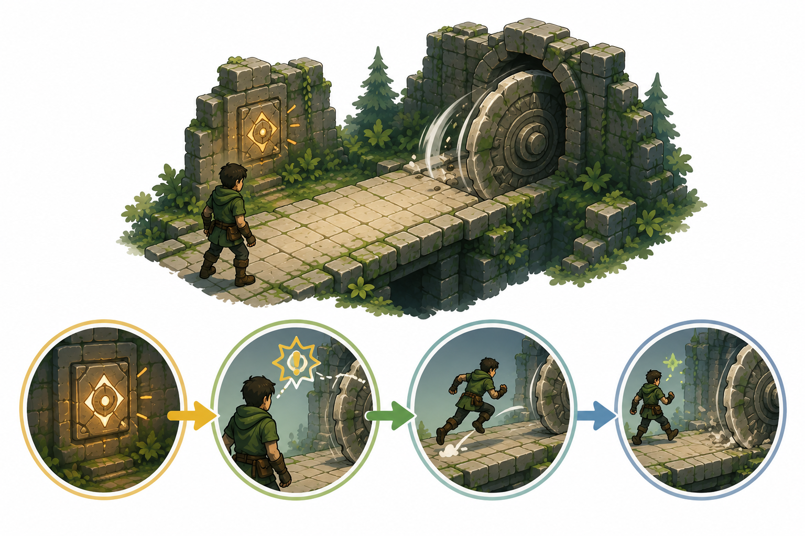

# Kapitel 8: Actionspel och reaktionsdesign

## Varför detta kapitel finns

Actionspel gör speldesign synlig i realtid. När spelaren hoppar över ett hål, undviker en projektil, siktar på en fiende eller parerar ett slag märks det direkt om kontrollen, feedbacken och svårighetsgraden fungerar. Små skillnader i timing, hastighet, avstånd och respons kan förändra hela spelupplevelsen.

I tidigare kapitel har vi pratat om mål, kärnloopar, regler, resurser, feedback, balans och pussel. I actionspel används samma byggstenar, men med större krav på omedelbarhet. Spelaren måste ofta fatta beslut snabbt och lita på att spelet är konsekvent.

Det här kapitlet handlar inte om att göra spelet “snabbt”. Det handlar om att förstå hur reaktion, precision och läsbarhet formar upplevelsen.

## Lärandemål

Efter kapitlet ska läsaren kunna:

- förklara vad reaktionsdesign innebär i actionspel
- beskriva sambandet mellan kontroll, timing och feedback
- skilja mellan rättvis och orättvis svårighet i snabba spelmoment
- analysera hur fiender, hinder och attackmönster kommunicerar risk
- designa ett enkelt actionmoment med tydliga beslut och läsbar respons

## Innan vi börjar

Vi återanvänder särskilt tre begrepp från tidigare kapitel.

**Feedback** visar spelaren vad som händer. **Spelkänsla** avgör om kontrollen upplevs direkt, tung, mjuk eller trög. **Svårighetskurva** beskriver hur kraven på spelaren förändras över tid.

I actionspel blir dessa begrepp extra känsliga. En knapptryckning som känns fördröjd, en fara som inte går att läsa eller en fiende som anfaller utan förvarning kan göra att spelaren upplever spelet som orättvist, även om reglerna tekniskt sett är konsekventa.

## Vad är reaktionsdesign?

Reaktionsdesign är arbetet med att forma situationer där spelaren måste uppfatta något, tolka det och agera inom en begränsad tid. Det kan vara en fysisk reaktion, som att hoppa vid rätt ögonblick, men också en taktisk reaktion, som att välja rätt vapen eller byta position.

En enkel reaktionskedja ser ut så här:

1. Spelet visar ett hot eller en möjlighet.
2. Spelaren uppfattar signalen.
3. Spelaren tolkar vad signalen betyder.
4. Spelaren väljer en handling.
5. Spelet svarar tydligt på handlingen.

Om någon del av kedjan är otydlig blir momentet svårare, men inte nödvändigtvis bättre. Bra actiondesign gör inte bara att spelaren måste reagera snabbt. Den gör att spelaren förstår vad som händer tillräckligt väl för att känna ansvar för sitt beslut.

### Reaktion är mer än reflex

Det är lätt att tro att actionspel främst handlar om reflexer. Reflexer spelar roll, men många bra actionspel bygger minst lika mycket på förberedelse, mönsterigenkänning och positionering.

Spelaren reagerar bättre när situationen är läsbar. En fiende som höjer vapnet innan den slår, en projektil som har tydlig färg och bana, eller en plattform som skakar innan den faller ger spelaren möjlighet att agera medvetet. Utan sådana signaler blir reaktionen mer gissning än skicklighet.

*Figur 8.1: Reaktionsdesign fungerar när spelaren hinner uppfatta signalen, tolka hotet, agera och förstå resultatet.*

## Tre centrala begrepp

### Timing

**Timing** handlar om när en handling behöver utföras och hur stort tidsfönster spelaren har. Ett hopp med generöst tidsfönster känns tillgängligt. Ett pareringsmoment med mycket litet tidsfönster känns krävande och intensivt.

Timing påverkas av flera faktorer:

- hur tidigt faran signaleras
- hur snabbt faran rör sig
- hur lång tid spelarens handling tar
- hur länge handlingen är aktiv
- hur tydligt spelet visar resultatet

En vanlig fallgrop är att bara minska tidsfönstret för att göra spelet svårare. Det kan fungera, men om signalen är otydlig eller kontrollen opålitlig upplevs svårigheten som orättvis.

### Läsbarhet

**Läsbarhet** är hur lätt spelaren kan uppfatta och förstå vad som händer. Det gäller både visuella, ljudmässiga och systemmässiga signaler.

Ett actionmoment med god läsbarhet gör det tydligt:

- vad som är farligt
- vad som kan användas
- vart spelaren kan röra sig
- när ett hot börjar
- när ett hot är över
- varför spelaren lyckades eller misslyckades

Läsbarhet betyder inte att allt ska vara enkelt. Det betyder att svårigheten ska ligga i att utföra, prioritera eller planera, inte i att försöka gissa vad designern menade.

### Responsfönster

Ett **responsfönster** är den tid spelaren har på sig att reagera efter att spelet gett en signal. Responsfönstret kan vara långt, kort eller nästan obefintligt.

I ett långsammare äventyrsspel kan en fälla börja mullra flera sekunder innan den aktiveras. I ett snabbt actionspel kan spelaren få en bråkdels sekund. Båda kan fungera om de passar spelets målgrupp och övriga design.

Responsfönster är nära kopplat till rättvisa. Om spelaren får se hotet i tid och har en rimlig handling tillgänglig känns misslyckandet ofta accepterbart. Om hotet kommer utan signal eller om rätt handling inte går att förstå känns misslyckandet godtyckligt.

## Kontroll och spelkänsla

Actionspel ställer höga krav på kontroll. Spelaren behöver förstå vad en knapptryckning gör, hur snabbt figuren reagerar och vilka begränsningar som finns.

Kontroll kan kännas olika utan att vara “rätt” eller “fel”. Ett snabbt arkadspel kan kräva direkt respons och korta animationer. Ett tyngre actionrollspel kan använda långsammare attacker för att skapa risk och tyngd. Ett plattformsspel kan låta spelaren justera hoppet i luften för att ge fin kontroll.

Det viktiga är att kontrollen stödjer den tänkta upplevelsen.

### Direkt kontroll

Direkt kontroll passar spel där precision, tempo och snabb korrigering är viktiga. Spelaren förväntar sig att handlingen sker nästan omedelbart. Om figuren fortsätter glida, låser sig i långa animationer eller reagerar sent kan spelet kännas opålitligt.

### Tung kontroll

Tung kontroll kan passa spel där varje handling ska kännas riskfylld. Långa attackanimationer, tydlig återhämtningstid och begränsad rörlighet kan skapa spänning. Men tung kontroll behöver fortfarande vara konsekvent. Spelaren måste förstå när en handling kan avbrytas och när den inte kan det.

### Förlåtande kontroll

Många actionspel använder små hjälpmedel som gör spelet mer spelbart utan att spelaren alltid märker det. Exempel är att ett hopp fortfarande accepteras ett ögonblick efter att spelaren lämnat en kant, eller att ett knapptryck registreras strax innan figuren landar. Sådana lösningar kan göra kontrollen mer mänsklig eftersom spelare sällan trycker exakt på rätt bildruta.

Det viktiga är att förlåtande kontroll inte tar bort ansvar. Den ska hjälpa spelet tolka spelarens avsikt, inte spela åt spelaren.

## Fiender som designverktyg

I actionspel är fiender inte bara hinder. De är designverktyg som skapar tempo, positionering, prioritering och risk.

En fiende kan lära spelaren att:

- röra sig i sidled
- hålla avstånd
- vänta på en öppning
- använda skydd
- byta mål
- läsa attackmönster
- hantera flera hot samtidigt

En bra fiende har därför ofta en tydlig roll. Den behöver inte vara komplex. En långsam fiende som tvingar spelaren att flytta sig kan vara lika viktig som en avancerad boss.

### Telegrafering

**Telegrafering** är när spelet signalerar en kommande handling innan den sker. En fiende kan lyfta armen, blinka, ladda upp ett ljud eller ändra kroppshållning innan den anfaller.

Telegrafering gör att spelaren kan reagera medvetet. Ju farligare attacken är, desto viktigare är det att signalen är tydlig. En omedelbar attack kan fungera om skadan är liten eller om attacken är en del av ett redan känt mönster. En dödlig attack utan förvarning känns oftast orättvis.

### Attackmönster

Ett **attackmönster** är en återkommande sekvens av hot och öppningar. Det kan vara enkelt, som “fienden skjuter tre gånger och pausar”, eller mer komplext, som en boss med flera faser.

Attackmönster ger spelaren något att lära sig. Första gången handlar det om att överleva. Andra gången börjar spelaren se rytmen. Tredje gången kan spelaren planera och utnyttja öppningar.

Det här knyter tillbaka till motivation. När spelaren märker att den lär sig, inte bara har tur, stärks viljan att försöka igen.

## Risk, belöning och positionering

Actionspel blir ofta intressanta när spelaren måste välja mellan säkerhet och möjlighet. Ska spelaren gå nära fienden för att göra mer skada? Ska spelaren vänta på ett säkert tillfälle eller chansa? Ska spelaren ta en svår väg för att nå en belöning?

Dessa beslut skapas genom relationen mellan risk och belöning.

I Skogsruinen kan ett actionmoment se ut så här:

Spelaren står i en korridor där roterande stenblad rör sig över golvet. På andra sidan finns en port. Längs väggen finns också ett sidospår med en extra sigillbit. Den säkra vägen kräver tålamod. Sidospåret kräver bättre timing men ger en belöning.

Momentet fungerar bara om spelaren kan läsa stenbladens rytm, förstå belöningen och lita på kontrollen. Om kameran skymmer faran eller om träffytorna är otydliga blir risken frustrerande.

## Genreexempel

### Plattformsspel

I plattformsspel är hopp, avstånd och landning centrala. Läsbarhet handlar ofta om kantpositioner, rörelsebanor och hinder. Spelaren behöver förstå var figuren kan landa och hur mycket kontroll som finns i luften.

Ett vanligt designval är om spelet ska vara exakt eller förlåtande. Ett exakt spel kan skapa stark skicklighetskänsla, men kräver mycket tydliga regler. Ett mer förlåtande spel kan passa bredare målgrupper och stödja utforskning.

### Shoot ’em up och twin-stick shooters

I skjutspel med många projektiler handlar reaktionsdesign om mönster, ytor och prioritering. Spelaren måste kunna skilja farliga projektiler från bakgrund, effekter och belöningar. För många visuella effekter kan göra spelet svårare på fel sätt.

Här blir kontrast, rörelsebanor och konsekventa regler viktiga. Om samma färg ibland betyder fara och ibland bonus ökar den kognitiva belastningen.

### Närstridsaction

I närstridsaction kretsar designen ofta kring avstånd, timing, animationer och öppningar. Spelaren behöver se när fienden är sårbar och när det är farligt att anfalla.

Tung närstrid kan skapa dramatik genom att varje handling binder spelaren. Snabb närstrid kan skapa flöde genom korta beslut och direkt respons. Båda kräver tydlig telegrafering.

### Stealth-action

Stealth-action kombinerar reaktion med planering. Spelaren reagerar på vakters rörelser, synfält och ljud, men försöker ofta undvika direkt konflikt. Här är läsbarhet kopplad till information: vad ser vakten, vad hörs och när är spelaren upptäckt?

Om spelet inte visar upptäcktsgrad eller fienders synfält på något sätt kan spelaren känna att reglerna är hemliga. Det gör misstag svåra att lära sig av.

## Rättvis svårighet i actionspel

Rättvis svårighet betyder inte att spelet är lätt. Det betyder att spelaren kan förstå varför något gick fel och vad som kan göras bättre nästa gång.

Ett actionmoment upplevs ofta som rättvist när:

- hotet signaleras i tid
- reglerna är konsekventa
- kontrollen motsvarar spelarens förväntan
- misslyckanden ger begriplig feedback
- spelaren har en rimlig möjlighet att förbättras

Orättvis svårighet uppstår ofta när spelet döljer viktig information, kräver perfekt timing utan träning eller straffar spelaren för något som inte gick att förutse.

### Straffets storlek

Straff påverkar hur spelaren tolkar svårighet. Ett litet misstag som kostar lite hälsa kan vara lärande. Ett litet misstag som skickar spelaren långt tillbaka kan kännas hårt. Det behöver inte vara fel, men det bör vara medvetet.

Om ett moment kräver många försök bör vägen tillbaka till försöket vara kort. Annars testar spelet tålamod snarare än skicklighet.

## Designworkshop: skapa ett actionmoment

Vi använder Skogsruinen som exempel.

### Steg 1: Bestäm vilken färdighet som testas

Momentet ska testa timing och positionsläsning, inte stridssystem eller resurshantering.

### Steg 2: Skapa ett tydligt hot

Ett stenblad sveper över en bro i regelbunden rytm. Innan bladet rör sig hörs ett mekaniskt klick och en skugga faller över bron.

### Steg 3: Ge spelaren ett rimligt responsfönster

Spelaren får två sekunder från signal till fara i den första versionen. Senare kan fönstret minska när spelaren lärt sig mönstret.

### Steg 4: Lägg till ett val

Den säkra vägen kräver att spelaren väntar. En alternativ väg ger en extra belöning men kräver två snabba rörelser efter varandra.

### Steg 5: Planera feedback

När spelaren träffas av bladet ska spelet visa tydlig skada, kort stopp i rörelsen och en ljudsignal. När spelaren lyckas passera ska kameran eller ljudet förstärka känslan av framgång utan att överdriva.

### Steg 6: Testa frågan “varför misslyckades spelaren?”

Efter varje test bör designern kunna svara på om spelaren misslyckades på grund av:

- otydlig signal
- för kort responsfönster
- opålitlig kontroll
- dålig kameravinkel
- rimlig men svår timing
- brist på tidigare träning

Endast den sista kategorin är ett bra skäl att behålla svårigheten oförändrad.

## Vanliga misstag

- **Misstag: Att förväxla snabbhet med kvalitet.**
  - Varför det händer: Snabba moment känns intensiva under utveckling.
  - Hur man undviker det: Bestäm först vilken färdighet som ska testas och anpassa tempot efter den.

- **Misstag: Att göra fiender farliga utan att göra dem läsbara.**
  - Varför det händer: Designern fokuserar på skada, hastighet och antal fiender.
  - Hur man undviker det: Ge fiender tydliga roller, signaler och attackmönster.

- **Misstag: Att använda otydliga träffytor.**
  - Varför det händer: Den visuella modellen och den faktiska kollisionsytan matchar inte.
  - Hur man undviker det: Gör farliga ytor konsekventa och hellre något mer förlåtande än bilden antyder.

- **Misstag: Att straffa spelaren hårt för små informationsfel.**
  - Varför det händer: Designern vill skapa spänning men underskattar hur lite spelaren vet första gången.
  - Hur man undviker det: Låt första mötet lära ut faran innan senare versioner höjer kraven.

## Övningar

### Övning 1: Läsbarhetsanalys

Välj ett actionmoment från ett spel du känner till. Identifiera vilka signaler som berättar för spelaren:

1. att fara är på väg
2. var faran uppstår
3. när spelaren bör agera
4. om handlingen lyckades
5. varför spelaren misslyckades

### Övning 2: Justera responsfönster

Designa en enkel fälla i Skogsruinen. Gör tre versioner:

- en nybörjarversion med långt responsfönster
- en normalversion med medellångt responsfönster
- en svår version med kort responsfönster

Förklara vad som ändras och vad som måste vara konstant för att alla versioner ska kännas rättvisa.

### Fördjupning

Skapa en fiende med en tydlig roll. Beskriv:

- vad fienden lär spelaren
- hur fienden telegraferar sin attack
- vilket attackmönster den använder
- vilken öppning spelaren får
- hur fienden kan kombineras med en annan fiendetyp utan att situationen blir oläslig

## Snabb sammanfattning

- Actiondesign handlar om snabb tolkning, tydlig respons och meningsfulla val under tidspress.
- Reaktionsdesign består av signal, tolkning, handling och feedback.
- Timing, läsbarhet och responsfönster avgör om ett moment känns rättvist.
- Fiender är designverktyg som skapar tempo, positionering och prioritering.
- Svårighet bör komma från färdighet och lärande, inte från otydlig information.
- Bra actionmoment låter spelaren förstå varför det gick fel och hur nästa försök kan bli bättre.

## Quiz/reflektionsfrågor

1. Vad är skillnaden mellan reflex och reaktionsdesign?
2. Varför är telegrafering viktigt i actionspel?
3. Hur kan ett kort responsfönster vara rättvist?
4. Vad kan göra ett actionmoment svårt på ett dåligt sätt?
5. Hur kan en fiende fungera som ett designverktyg snarare än bara ett hinder?

## Nästa steg

I nästa kapitel går vi från snabba reaktioner till långsiktiga system. Strategi- och simulationsspel använder många av samma grundbegrepp, men flyttar fokus från omedelbar timing till planering, resurser, emergens och konsekvenser över tid.
