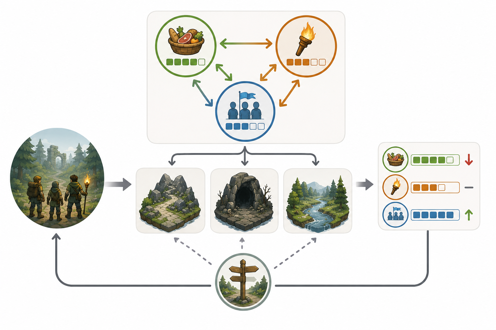

# Kapitel 9: Strategi- och simulationsspel

## Varför detta kapitel finns

Strategi- och simulationsspel gör speldesign långsammare, bredare och mer systemisk. Där actionspel ofta prövar spelarens reaktion i stunden, prövar strategispel spelarens förmåga att förstå samband över tid. Ett beslut kan vara enkelt när det tas, men få konsekvenser flera minuter, timmar eller speldagar senare.

I tidigare kapitel har vi arbetat med regler, resurser, begränsningar, feedback och balans. I strategi- och simulationsspel blir dessa byggstenar extra tydliga. Spelaren hanterar ofta flera resurser, konkurrerande mål och system som påverkar varandra.

Det här kapitlet handlar om hur man designar spel där det intressanta inte bara är vad spelaren gör nu, utan vad spelarens beslut leder till senare.

## Lärandemål

Efter kapitlet ska läsaren kunna:

- förklara vad systemisk design innebär i strategi- och simulationsspel
- beskriva skillnaden mellan kortsiktiga och långsiktiga beslut
- analysera hur resurser, regler och återkoppling skapar strategiska val
- förklara begreppet emergens och varför det kan vara värdefullt men svårt att kontrollera
- designa ett enkelt strategiskt resurssystem med tydliga avvägningar

## Innan vi börjar

Vi återanvänder särskilt tre begrepp.

**Resurser** är sådant spelaren kan samla, spendera, skydda eller förlora. **Begränsningar** hindrar spelaren från att göra allt samtidigt. **Balans** handlar om att justera regler och konsekvenser så att besluten blir intressanta.

I strategi- och simulationsspel är det sällan en ensam mekanik som skapar upplevelsen. Det är relationen mellan flera mekaniker. Därför behöver designern tänka mer på system än på enskilda händelser.

## Systemisk design

Ett system är en uppsättning delar som påverkar varandra. I ett spel kan delarna vara resurser, enheter, byggnader, kartområden, väder, fiender, invånare, ekonomi eller tid. Det viktiga är inte bara att delarna finns, utan att förändringar i en del påverkar andra delar.

I ett enkelt strategispel kan spelaren samla mat, bygga skydd och rekrytera expeditionsmedlemmar. Mat behövs för att överleva. Skydd minskar risken för skada. Fler expeditionsmedlemmar gör det lättare att utforska, men de förbrukar mer mat. Redan här finns ett system:

- mer utforskning kan ge fler resurser
- fler personer gör utforskning effektivare
- fler personer ökar resursförbrukningen
- brist på mat kan stoppa framtida utforskning

Det intressanta ligger i sambanden. Spelaren frågar inte bara “vad kan jag göra?” utan “vad får det här för följder?”.

### System kräver läsbarhet

Ett system behöver inte vara enkelt, men det måste vara möjligt att förstå. Om spelaren inte kan se varför maten tog slut, varför staden gjorde uppror eller varför en fiende blev starkare känns spelet godtyckligt.

Läsbarhet i strategispel handlar därför om att visa samband. Spelaren behöver kunna se orsaker, trender och risker. Det kan göras med siffror, ikoner, varningar, kartförändringar, loggar eller tydliga konsekvenser i världen.

Bra systemisk design låter spelaren tänka: “Jag förlorade inte för att spelet lurade mig. Jag förlorade för att jag missbedömde systemet.”

*Figur 9.1: Strategiska resurser blir intressanta när de påverkar varandra och förändrar framtida val.*

## Strategiska beslut

Ett strategiskt beslut är ett val där konsekvensen är större än den omedelbara handlingen. Att öppna en dörr kan vara ett taktiskt beslut. Att välja vilken del av kartan som ska utforskas först kan vara strategiskt, eftersom det påverkar resurser, risker och framtida möjligheter.

Strategiska beslut brukar innehålla minst en avvägning:

- säkerhet mot belöning
- kortsiktig vinst mot långsiktig styrka
- specialisering mot flexibilitet
- expansion mot stabilitet
- information mot handling

Ett val blir svagt om ett alternativ nästan alltid är bäst. Om spelaren alltid bör bygga samma sak först, välja samma rutt eller maximera samma resurs blir strategin snabbt mekanisk. Målet är inte att alla alternativ ska vara lika. Målet är att alternativen ska vara rimliga under olika omständigheter.

### Taktik och strategi

Taktik handlar om hur spelaren löser en konkret situation. Strategi handlar om vilken situation spelaren försöker skapa.

I Skogsruinen kan ett taktiskt beslut vara att använda en fackla för att skrämma bort en varelse i ett rum. Ett strategiskt beslut är att spara facklorna till djupare delar av ruinen, även om det gör de första rummen farligare.

Taktik frågar: “Hur klarar jag detta nu?”
Strategi frågar: “Vilken framtid försöker jag bygga?”

Båda kan finnas i samma spel, men de behöver inte ha samma tempo.

## Simulationsdesign

En simulation försöker modellera ett beteende eller en process. Den behöver inte vara realistisk i vetenskaplig mening. Den behöver vara konsekvent och meningsfull för spelets syfte.

En bondgårdssimulation kan förenkla väder, jord, ekonomi och djurvård kraftigt. Det viktiga är att spelaren upplever samband: grödor behöver tid, väder påverkar resultat, investeringar ändrar framtida möjligheter och dålig planering skapar problem.

En bra spelsimulation är inte en komplett kopia av verkligheten. Den är en designad modell. Den väljer ut vissa samband och gör dem spelbara.

### Modellens fokus

När du designar en simulation behöver du fråga:

- Vad ska spelaren förstå?
- Vilka samband ska vara centrala?
- Vilka detaljer kan förenklas bort?
- Hur ska spelaren se att modellen reagerar?
- Vilken typ av beslut ska modellen skapa?

Om Skogsruinen blir ett simulationsspel kan fokus ligga på expeditionens logistik. Då är inte huvudfrågan hur snabbt spelaren kan hoppa undan en fälla, utan hur spelaren planerar ljus, mat, vila, verktyg och risk över flera dagar.

## Emergens

Emergens uppstår när enkla regler samverkar så att mer komplexa situationer uppstår. Designern har inte nödvändigtvis skrivit varje situation direkt, men har skapat regler som gör situationen möjlig.

Tänk dig följande regler:

1. Facklor håller rovdjur borta.
2. Facklor förbrukas över tid.
3. Regn gör att facklor brinner snabbare.
4. Vissa genvägar går genom våta tunnlar.
5. Djupare rum har bättre belöningar.

Ingen regel säger uttryckligen: “Spelaren ska tvingas välja mellan en säker lång väg och en farlig genväg under regn.” Ändå kan en sådan situation uppstå ur reglernas samspel.

Emergens är kraftfullt eftersom det kan skapa variation, berättelser och överraskningar. Men det är också riskabelt. Om systemen samverkar på otydliga eller extrema sätt kan spelet bli svårt att balansera.

### Designerns ansvar vid emergens

Emergens betyder inte att designern släpper kontrollen helt. Designern behöver fortfarande styra:

- vilka system som får påverka varandra
- hur starka effekterna är
- hur spelaren får information
- hur allvarliga konsekvenserna blir
- hur spelet återhämtar sig från extrema tillstånd

Ett system där små misstag leder till omedelbar kollaps kan vara frustrerande. Ett system där dåliga beslut aldrig får konsekvenser blir ointressant. Den svåra delen är att skapa utrymme för oväntade händelser utan att spelaren tappar känslan av ansvar.

## Resurssystem

Resurssystem är centrala i många strategi- och simulationsspel. Ett bra resurssystem skapar avvägningar, inte bara insamling.

En resurs kan ha olika funktioner:

- **Bränsle:** krävs för att agera, till exempel energi eller ammunition.
- **Valuta:** används för att köpa eller uppgradera.
- **Tidsbegränsning:** tvingar spelaren att prioritera.
- **Riskmätare:** visar hur nära spelaren är ett problem.
- **Framstegsmätare:** visar utveckling mot ett mål.

Samma resurs kan fylla flera roller. Mat i Skogsruinen kan vara bränsle för expeditionen, riskmätare för svält och strategisk begränsning för hur långt spelaren vågar gå.

### En resurs är inte automatiskt intressant

En vanlig fallgrop är att lägga till många resurser i tron att spelet blir djupare. Fler resurser skapar inte automatiskt bättre design. De kan lika gärna skapa administration utan meningsfulla val.

Fråga alltid:

- Vilket beslut skapar resursen?
- Vad händer om spelaren har för lite?
- Vad händer om spelaren har för mycket?
- Går resursen att påverka på flera sätt?
- Är informationen tydlig nog för planering?

Om en resurs bara behöver hållas över noll utan att skapa val är den kanske bara ett hinder. Om den däremot tvingar spelaren att välja mellan utforskning, säkerhet och framtida investeringar kan den bli strategiskt intressant.

## Genreöversikt

Strategi- och simulationsspel är breda kategorier. Här är några vanliga inriktningar och vad de brukar betona.

| Typ | Vanligt fokus | Designrisk |
|---|---|---|
| Turordningsbaserad strategi | Planering, positionering, långsiktiga konsekvenser | För långsam rytm eller dominanta strategier |
| Realtidsstrategi | Snabb prioritering, ekonomi och kartkontroll | Överbelastning och otydlig information |
| Stadsbyggare | Systembalans, tillväxt och stabilitet | För mycket väntan eller för få meningsfulla val |
| Managementspel | Optimering, ekonomi och processer | För mycket kalkyl utan upplevelse |
| Survival-simulation | Resurser, risk och osäkerhet | Straff som känns slumpmässiga |
| Systemisk sandbox | Emergens och experiment | Brist på riktning eller mål |

Tabellen är inte en exakt genreindelning. Den visar snarare att olika speltyper använder system på olika sätt. En stadsbyggare behöver ofta tydlig återkoppling på trender. Ett survivalspel behöver risk och osäkerhet. Ett managementspel behöver beslut som inte bara har ett matematiskt bästa svar.

## Skogsruinen som strategi- och simulationsspel

Om Skogsruinen designas som strategi- och simulationsspel kan spelaren leda en expedition i stället för att direkt styra en ensam hjälte.

Spelarens mål kan vara att nå den förseglade kammaren längst in i ruinen. För att lyckas behöver expeditionen hantera:

- mat
- facklor
- verktyg
- moral
- skador
- kunskap om kartan
- tid innan stormen gör ruinen farligare

Kärnloopen förändras:

1. Planera expeditionens nästa steg.
2. Välj rutt, utrustning och risknivå.
3. Utforska ett område.
4. Hantera konsekvenser.
5. Uppdatera resurser och kunskap.
6. Planera nästa steg.

Här blir det centrala inte enskilda hinder, utan hur hinder påverkar expeditionens framtid. En fälla är inte bara skada. Den kan innebära att en gruppmedlem behöver vila, att verktyg går sönder eller att spelaren måste välja en säkrare men längre väg.

### Exempel på strategisk avvägning

Anta att spelaren har två möjliga rutter.

Den korta vägen går genom en fuktig tunnel. Den sparar tid men gör att facklor brinner snabbare. Den långa vägen går genom torra salar men kräver mer mat och ökar risken för moralproblem.

Båda vägarna kan vara rätt. Valet beror på expeditionens tillstånd, spelarens mål och vad spelaren tror väntar längre fram. Det är ett starkare strategiskt val än “kort väg är alltid bäst” eller “lång väg är alltid säkrast”.

## Feedback i långsamma system

Feedback i strategi- och simulationsspel behöver ofta visa mer än omedelbara händelser. Spelaren behöver förstå trender.

Exempel:

- Mat: “3 dagar kvar i nuvarande takt.”
- Moral: “Sjunker på grund av mörker och skador.”
- Risk: “Fuktiga tunnlar ökar fackelförbrukning.”
- Utforskning: “Ny genväg upptäckt.”
- Hot: “Varelser rör sig närmare lägret.”

Utan sådan information blir strategiska beslut gissningar. Med för mycket information kan spelet bli en kalkylator. Designern behöver välja hur exakt feedbacken ska vara.

I vissa spel är exakt siffervisning rätt. I andra är ungefärliga indikatorer bättre: låg, medel, hög risk. Valet beror på vilken upplevelse du vill skapa. Ett analytiskt strategispel kan tåla mycket data. Ett stämningsdrivet expeditionsspel kanske mår bättre av osäkerhet.

## Vanliga misstag

- **För många resurser utan tydliga val.**
  - Varför det händer: Designern vill skapa djup genom att lägga till fler mätare.
  - Hur man undviker det: Ge varje resurs en tydlig roll i minst ett viktigt beslut.

- **Dominant strategi.**
  - Varför det händer: Ett alternativ är nästan alltid effektivast.
  - Hur man undviker det: Testa om olika situationer faktiskt gör olika val rimliga.

- **Otydliga systemkonsekvenser.**
  - Varför det händer: Sambanden finns i reglerna men syns inte för spelaren.
  - Hur man undviker det: Visa orsaker, trender och varningar innan konsekvensen blir för hård.

- **Slump som ersätter strategi.**
  - Varför det händer: Osäkerhet används för att skapa variation.
  - Hur man undviker det: Låt slump skapa situationer, men låt spelarens beslut påverka risk och utfall.

- **Simulation utan designfokus.**
  - Varför det händer: Designern försöker modellera för många detaljer.
  - Hur man undviker det: Bestäm vilken upplevelse och vilka beslut modellen ska stödja.

## Designworkshop: skapa ett litet resurssystem

Utgå från Skogsruinen eller en egen spelidé. Skapa ett resurssystem med tre resurser.

För varje resurs, skriv:

1. Vad representerar resursen?
2. Hur får spelaren mer av den?
3. Hur förloras eller förbrukas den?
4. Vilket beslut ska den skapa?
5. Hur får spelaren feedback om resursens tillstånd?

Exempel:

| Resurs | Funktion | Designfråga |
|---|---|---|
| Facklor | Ljuskälla och skydd | Vågar spelaren gå djupare eller bör expeditionen återvända? |
| Mat | Expeditionens uthållighet | Ska spelaren ta en lång säker väg eller kort farlig väg? |
| Moral | Gruppens stabilitet | Är snabb framgång viktigare än att undvika stress? |

När du har skapat resurserna, kontrollera om någon av dem bara är dekoration. En resurs som inte påverkar beslut behöver antingen få en tydligare roll eller tas bort.

## Snabb sammanfattning

- Strategi- och simulationsspel bygger ofta på system där flera delar påverkar varandra.
- Strategiska beslut handlar om framtida konsekvenser, inte bara omedelbara handlingar.
- En simulation är en designad modell, inte en komplett kopia av verkligheten.
- Emergens uppstår när enkla regler samverkar och skapar komplexa situationer.
- Resurser blir intressanta först när de skapar meningsfulla avvägningar.
- Långsamma system behöver feedback som visar orsaker, trender och risker.

## Quiz och reflektionsfrågor

1. Vad är skillnaden mellan ett taktiskt och ett strategiskt beslut?
2. Varför kan fler resurser göra ett spel sämre i stället för bättre?
3. Vad menas med emergens i speldesign?
4. Hur kan feedback hjälpa spelaren förstå ett långsamt system?
5. Välj ett strategispel eller simulationsspel du känner till. Vilken resurs skapar de mest intressanta besluten, och varför?

## Nästa steg

I nästa kapitel går vi vidare till rollspel och progression. Där flyttas fokus från systemens utveckling till spelarens och karaktärens utveckling: förmågor, identitet, val, belöningar och känslan av att bli någon i spelets värld.
