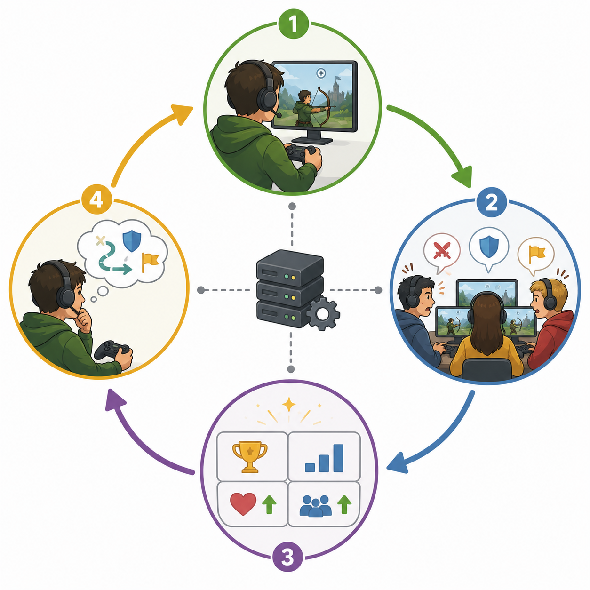

# Kapitel 11: Multiplayer och social design

## Varför detta kapitel finns

Multiplayer förändrar speldesign på ett grundläggande sätt. I ett enspelarläge kan designern kontrollera mycket av motståndet, tempot och feedbacken. I ett flerspelarläge blir andra människor en del av systemet. De kan samarbeta, tävla, fuska, missförstå, hjälpa, dominera, skämta, sabotera eller skapa oväntade strategier.

Det gör multiplayerdesign både kraftfull och svår. En enkel regel kan få helt olika effekt beroende på vilka spelare som möts, hur de kommunicerar och vad de tror att spelet belönar. Det som känns spännande för en spelare kan kännas orättvist för en annan. Det som skapar gemenskap i en grupp kan skapa utanförskap i en annan.

Det här kapitlet handlar om social design: hur spel skapar relationer, roller, samarbete och konflikt mellan spelare. Vi fokuserar inte på nätverkskod eller teknisk implementation. Fokus ligger på designfrågan: vad händer när spelare blir varandras innehåll?

## Lärandemål

Efter kapitlet ska läsaren kunna:

- förklara hur multiplayer skiljer sig från enspelardesign
- skilja mellan samarbete, tävling och social närvaro som designformer
- analysera hur regler och belöningar formar spelarbeteenden
- beskriva vanliga risker i multiplayerdesign, som dominans, frustration och negativt socialt beteende
- designa en enkel social loop för ett multiplayerkoncept

## Innan vi börjar

Vi använder flera tidigare begrepp i en ny kontext.

**Mål** blir mer komplexa när flera spelare har egna mål samtidigt. **Kärnloopar** kan vara individuella, gemensamma eller motstridiga. **Feedback** måste ofta visa både vad spelaren själv gör och vad andra gör. **Balans** handlar inte bara om svårighetsgrad, utan också om rättvisa mellan spelare. **Progression** kan påverka relationer, status och tillgång till gruppens aktiviteter.

Multiplayer gör alltså inte tidigare designprinciper irrelevanta. Det gör dem synligare och mer känsliga.

## Vad multiplayer tillför

Multiplayer tillför en källa till variation som är svår att skapa med enbart system: andra människor. En mänsklig motståndare kan överraska. En mänsklig medspelare kan göra en enkel uppgift känslomässigt viktig. En mänsklig publik kan göra en prestation mer laddad.

Det betyder att multiplayer inte bara är en teknisk funktion. Det är en upplevelsedesign.

Tre saker blir särskilt viktiga:

- andra spelare kan skapa oförutsägbara situationer
- sociala normer kan bli lika viktiga som formella regler
- spelaren tolkar spelet genom jämförelse med andra

I ett pusselspel kan en svår nivå kännas som en personlig utmaning. I ett tävlingsspel kan samma svårighet kännas som orättvisa om spelaren tror att motståndaren hade bättre förutsättningar. I ett samarbetsspel kan ett misstag bli komiskt, pinsamt eller konfliktskapande beroende på gruppen.

Multiplayer förstärker därför både positiva och negativa upplevelser.

## Tre grundformer av social design

Multiplayer kan beskrivas på många sätt, men som nybörjarmodell är det användbart att skilja mellan tre grundformer: samarbete, tävling och social närvaro.

### Samarbete

I samarbete arbetar spelare mot ett gemensamt mål. De kan ha samma verktyg, olika roller eller kompletterande förmågor.

Exempel:

- två spelare måste trycka på varsin knapp samtidigt
- en spelare skyddar medan en annan reparerar
- ett lag samlar resurser till en gemensam bas
- en grupp planerar hur de ska besegra en stark fiende

Samarbetsdesign fungerar bäst när spelarna faktiskt behöver varandra. Om en skicklig spelare kan göra allt själv blir de andra lätt passiva. Om varje spelare bara gör sin egen separata uppgift kan spelet kännas som parallellt enspelarläge snarare än samarbete.

En stark samarbetsdesign skapar beroenden som är begripliga och rättvisa.

### Tävling

I tävling försöker spelare nå mål som står i konflikt med varandra. En spelares framgång är ofta en annan spelares problem.

Exempel:

- först till mållinjen
- flest poäng efter fem minuter
- kontrollera flest områden
- överleva medan andra elimineras

Tävlingsdesign kräver tydlighet. Spelaren behöver förstå varför hen vann eller förlorade. Om förlusten känns slumpmässig eller obegriplig blir motivationen svagare. Det betyder inte att tävlingsspel måste vara helt rättvisa i varje ögonblick, men spelaren behöver kunna se en rimlig koppling mellan val, skicklighet, risk och resultat.

Tävling mår ofta bra av en tydlig feedbackkedja: handling, konsekvens, lärdom.

### Social närvaro

Social närvaro betyder att andra spelare påverkar upplevelsen utan att nödvändigtvis samarbeta eller tävla direkt.

Exempel:

- spelare möts i en gemensam hubb
- andra spelares skapelser syns i världen
- en spelare kan lämna meddelanden eller spår
- åskådare reagerar på spelarens prestation
- spelare visar status genom utseende, titel eller utrustning

Social närvaro kan göra ett spel mer levande. Den kan också skapa press. Om spelaren känner sig bedömd kan hen bli mer engagerad, men också mer försiktig. Designern behöver därför tänka på hur synlig spelaren är, vad som jämförs och vilka sociala signaler spelet förstärker.

## Sociala loopar

En social loop är en återkommande cykel där spelarens handling påverkar andra spelare och deras respons påverkar spelarens nästa handling.

En enkel social loop kan se ut så här:

1. spelaren gör något synligt
2. andra spelare reagerar
3. spelet förstärker reaktionen med feedback, belöning eller status
4. spelaren justerar sitt beteende

Exempel i ett samarbetsspel:

1. spelaren återupplivar en lagkamrat
2. lagkamraten kan fortsätta spela och tackar eller hjälper tillbaka
3. spelet ger poäng, ljudfeedback eller en tydlig räddningsmarkering
4. spelaren börjar se räddningar som en del av sin roll

Exempel i ett tävlingsspel:

1. spelaren tar en riskfylld genväg
2. motståndare ser försöket och försöker blockera
3. spelet visar tidsvinst eller misslyckande tydligt
4. spelaren lär sig när genvägen är värd risken

Sociala loopar är viktiga eftersom multiplayer ofta lever av upprepade beteenden. Spelet bör därför belöna de beteenden som stärker upplevelsen, inte bara de beteenden som råkar vara mest effektiva.

*Figur 11.1: En social loop där spelare påverkar varandras nästa handlingar.*

## Roller och beroenden

Roller hjälper spelare att förstå vad de bidrar med. En roll kan vara formell, som healer, tank eller damage dealer. Den kan också vara informell, som ledare, utforskare, taktiker, byggare eller skojare.

Bra roller har tre egenskaper:

- de är begripliga
- de bidrar tydligt till gruppen
- de ger spelaren meningsfulla beslut

En roll blir svag om den bara är en etikett. Om en “supportroll” bara trycker på samma knapp för att höja andras siffror kan den kännas platt. Om rollen däremot måste välja vem som ska hjälpas, när resurser ska sparas och hur risker ska hanteras blir den mer intressant.

Beroenden mellan roller behöver vara lagom starka. För svaga beroenden gör att spelarna inte behöver samarbeta. För starka beroenden gör att en spelares misstag förstör allt för gruppen.

En praktisk designfråga är:

**Vad kan varje roll göra ensam, och vad blir bättre tillsammans med andra?**

Det svaret hjälper designern att undvika både passivitet och överberoende.

## Rättvisa och upplevd rättvisa

I multiplayer är faktisk rättvisa och upplevd rättvisa inte alltid samma sak. Ett system kan vara matematiskt balanserat men ändå kännas orättvist. Ett annat system kan innehålla slump men ändå kännas accepterat om spelaren förstår risken och har möjlighet att påverka den.

Upplevd rättvisa påverkas av flera saker:

- om spelaren förstår reglerna
- om motståndaren verkar ha samma möjligheter
- om förlusten går att lära sig något av
- om slumpens roll är tydlig
- om spelet visar relevanta orsaker till resultatet

I tävlingsspel är det därför viktigt att visa varför något hände. Blev spelaren träffad för att hen stod fel? För att motståndaren tog en smart vinkel? För att en resurs saknades? För att systemet matchade ihop spelare med mycket olika färdighet?

Ju mer spelaren kan förstå, desto lättare blir det att acceptera även en förlust.

## Matchning och skillnad mellan spelare

Alla multiplayerupplevelser påverkas av vilka spelare som möts. Stor skillnad i skicklighet kan skapa problem. Den bättre spelaren kan bli uttråkad medan den svagare spelaren känner sig chanslös.

Design kan hantera detta på olika sätt:

- matcha spelare med liknande nivå
- skapa lag där olika roller kan bidra på olika sätt
- låta mindre erfarna spelare få säkra uppgifter
- använda mål som inte bara belönar teknisk skicklighet
- ge tydlig återkoppling som hjälper spelaren förstå nästa steg

Det är frestande att lösa allt med siffror och matchmaking, men designen av själva aktiviteten är minst lika viktig. Ett spel där bara precision avgör allt kommer att förstärka skillnad i precision. Ett spel där kommunikation, planering, positionering och risktagande också spelar roll kan ge fler typer av spelare möjlighet att bidra.

## Negativt beteende som designproblem

Multiplayer kan skapa stark gemenskap, men också konflikter. Negativt beteende bör inte bara ses som ett modereringsproblem efteråt. Det är ofta också en designfråga.

Fråga:

**Vilka beteenden gör spelet lättast, snabbast eller mest belönande?**

Om spelet belönar individuell poäng mer än lagets mål kan spelare ignorera samarbetet. Om spelet gör det lönsamt att sabotera för nybörjare kommer någon att göra det. Om spelet synliggör misslyckanden men inte bidrag kan vissa roller få skulden oftare än de förtjänar.

Designern kan minska riskerna genom att:

- belöna hjälpsamt beteende
- synliggöra flera typer av bidrag
- minska möjligheten att blockera andra spelare i onödan
- göra kommunikation tydlig men inte tvingande
- undvika system som gör en enskild spelare till ständig syndabock

Målet är inte att kontrollera allt spelarbeteende. Målet är att spelets struktur ska göra önskvärda beteenden naturliga.

## Kommunikation

Kommunikation är en central del av många multiplayerupplevelser. Den kan vara text, röst, pings, emotes, kartmarkörer, animationer eller bara spelvärldens läsbara situationer.

Mer kommunikation är inte alltid bättre. Röstchatt kan ge taktiskt djup, men också social press. Textchatt kan ge flexibilitet, men avbryta tempo. Pings kan vara snabba och säkra, men ibland för begränsade.

En bra kommunikationsdesign utgår från vad spelarna faktiskt behöver uttrycka.

Exempel:

- “här finns fara”
- “jag behöver hjälp”
- “följ mig”
- “vänta”
- “bra gjort”
- “jag tar den här rollen”

När ett spel kräver samarbete men saknar sätt att uttrycka viktiga behov skapas frustration. När ett spel däremot ger enkla och kontextkänsliga kommunikationsverktyg kan även okända spelare samarbeta bättre.

## Genreexempel

### Kooperativa actionspel

I kooperativa actionspel behöver designen skapa tryck utan att göra gruppen helt beroende av perfekt spel. Fiender, resurser och mål bör få spelarna att röra sig tillsammans, rädda varandra och fatta snabba beslut.

Vanlig fallgrop: en spelare kan springa före och spela ensam, medan resten följer efter utan betydelse.

Designfråga: vilka situationer gör gruppens samarbete värdefullt just nu?

### Tävlingsinriktade arenaspel

I arenaspel är läsbarhet och rättvisa centralt. Spelaren behöver snabbt förstå position, hot, resurser och resultat. Kartor, vapen, rörelse och spawnpunkter påverkar hur rättvis matchen känns.

Vanlig fallgrop: vinnande spelare får så stora fördelar att matchen snabbt känns avgjord.

Designfråga: hur kan spelet belöna skicklighet utan att ta bort möjligheten till vändning?

### Sociala bygg- och överlevnadsspel

I sociala bygg- och överlevnadsspel är spelarna ofta både innehåll och risk. De kan skapa gemensamma projekt, handel, konflikter och berättelser.

Vanlig fallgrop: systemet ger för mycket makt åt destruktiva spelare och för lite skydd åt långsiktigt byggande.

Designfråga: vilka sociala kontrakt uppmuntrar spelet, och vilka bryter det?

### Partyspel

Partyspel bygger ofta på korta rundor, enkel förståelse och hög social energi. Designen behöver tillåta misstag utan att spelaren känner sig dum för länge.

Vanlig fallgrop: reglerna är roliga för den som redan förstår dem men förvirrande för nya spelare.

Designfråga: hur snabbt kan en ny spelare förstå vad som är roligt att försöka göra?

## Vanliga misstag

- **Att tro att multiplayer automatiskt skapar djup.**
  - Varför det händer: andra spelare känns som en enkel källa till variation.
  - Hur man undviker det: designa tydliga sociala loopar och roller.

- **Att bara balansera siffror.**
  - Varför det händer: siffror är lättare att justera än upplevelser.
  - Hur man undviker det: testa om spelare förstår varför de vinner, förlorar och bidrar.

- **Att belöna fel beteende.**
  - Varför det händer: poängsystemet mäter det som är enkelt att mäta.
  - Hur man undviker det: kontrollera om belöningar stödjer den sociala upplevelse du vill skapa.

- **Att göra samarbete beroende av perfekt kommunikation.**
  - Varför det händer: designern testar ofta med motiverade personer som pratar bra med varandra.
  - Hur man undviker det: ge spelarna tydliga visuella signaler och enkla kommunikationsverktyg.

- **Att synliggöra skuld mer än bidrag.**
  - Varför det händer: misslyckanden är ofta mer dramatiska än stödhandlingar.
  - Hur man undviker det: visa räddningar, assistans, positionering och andra positiva bidrag.

## Övningar

### Övning 1: Identifiera den sociala formen

Välj ett multiplayer- eller samarbetsmoment från ett spel du känner till.

Besvara:

1. Är momentet främst samarbete, tävling eller social närvaro?
2. Vad gör andra spelare som systemet inte hade kunnat göra lika lätt själv?
3. Vilket beteende belönas tydligast?
4. Finns det något beteende som spelet råkar uppmuntra, även om det inte verkar avsiktligt?

### Övning 2: Designa en social loop

Skapa en enkel social loop för ett tänkt spel.

Använd denna mall:

1. Spelaren gör:
2. Andra spelare reagerar genom:
3. Spelet ger feedback via:
4. Spelaren motiveras att:
5. Loopen riskerar att bli negativ om:

Målet är inte att skapa ett helt spel, utan att se hur socialt beteende kan designas som en loop.

### Övning 3: Gör ett enspelarmoment socialt

Ta ett enkelt enspelarmoment, till exempel att samla nycklar, lösa ett rumspussel eller besegra en fiende.

Gör tre varianter:

1. en kooperativ version
2. en tävlingsversion
3. en version med social närvaro utan direkt konflikt

Beskriv vad som behöver ändras i regler, feedback och mål.

### Fördjupning

Analysera ett spel där multiplayerupplevelsen ibland blir negativ.

Försök skilja på:

- tekniska problem
- spelarens attityd
- regler som uppmuntrar beteendet
- belöningar som förstärker beteendet
- kommunikationsbrister
- synlighet av skuld och bidrag

Skriv sedan två designändringar som skulle kunna minska problemet utan att ta bort spelets kärnupplevelse.

## Snabb sammanfattning

- Multiplayer gör andra spelare till en del av spelsystemet.
- Social design handlar om relationer, roller, samarbete, konflikt och synlighet.
- Samarbete kräver meningsfulla beroenden mellan spelare.
- Tävling kräver begriplig feedback och upplevd rättvisa.
- Social närvaro kan skapa liv, status och gemenskap utan direkt konflikt.
- Belöningssystem formar spelarbeteenden, även när designern inte tänkt på det.
- Negativt beteende är ofta både ett socialt och ett strukturellt designproblem.
- Kommunikation bör stödja de behov spelet faktiskt skapar.

## Quiz/reflektionsfrågor

1. Varför är upplevd rättvisa ibland viktigare än matematisk rättvisa?
2. Vad är skillnaden mellan samarbete och parallellt enspelarläge?
3. Hur kan ett poängsystem råka uppmuntra dåligt lagspel?
4. Vilka risker finns med att göra alla spelares misstag mycket synliga?
5. Vad är en social loop, och hur skiljer den sig från en vanlig kärnloop?

## Nästa steg

I nästa kapitel knyter vi ihop boken genom att gå från kopior av existerande enkla spel till egna designidéer. Då använder vi bokens centrala begrepp som verktyg för att analysera, förändra och utveckla ett spelkoncept med tydligare egen identitet.
