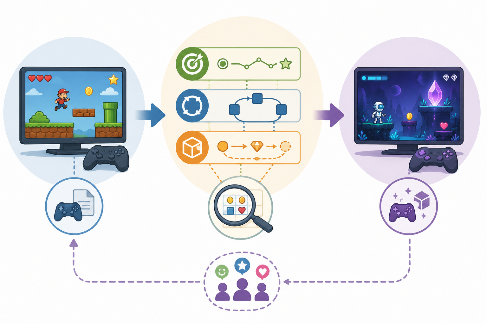

# Kapitel 12: Från kopia till egen design

## Varför detta kapitel finns

Många börjar sin resa som spelskapare genom att bygga kopior av enkla spel. Det är ett bra sätt att lära sig teknik, struktur och grundläggande interaktion. En kopia av Pong, Breakout, Snake, Tetris-liknande blockpussel eller ett enkelt plattformsspel kan lära ut mycket om input, kollisioner, tillstånd, poäng och återstart.

Men en kopia lär inte automatiskt ut speldesign. Den visar hur ett känt spel fungerar, men inte alltid varför det fungerar. Den kan också skapa en falsk trygghet: om tekniken fungerar känns projektet färdigt, trots att designen egentligen bara är lånad.

Det här avslutande kapitlet handlar om steget från att återskapa till att designa. Målet är inte att du aldrig ska inspireras av befintliga spel. Tvärtom är analys av befintliga spel en viktig designfärdighet. Skillnaden ligger i hur du använder analysen. En kopia försöker återskapa ytan. En egen design försöker förstå principen och göra ett medvetet val.

Kapitlet knyter ihop bokens begrepp: mål, motivation, kärnloop, regler, resurser, feedback, balans, genre, progression och social design. Du får en arbetsmodell för att omvandla en befintlig spelidé till något eget utan att börja med ett tomt dokument.

## Lärandemål

Efter kapitlet ska läsaren kunna:

- skilja mellan imitation, variation och egen design
- analysera ett enkelt spel genom designlager
- formulera en designhypotes
- ändra en spelidé genom medvetna designval
- skapa ett litet designunderlag för en egen prototyp
- använda bokens begrepp som checklista för fortsatt arbete

## Innan vi börjar

Vi utgår från att du redan kan bygga eller föreställa dig enkla spelprototyper. Du behöver inte vara expert på grafik, ljud eller spelmotorer. Det viktiga är att du kan tänka i regler, handlingar och konsekvenser.

Från tidigare kapitel tar vi med oss tre centrala idéer.

För det första: ett spel är inte bara en idé. Det är en uppsättning regler, mål, mekaniker, feedback och upplevelser.

För det andra: spelupplevelsen uppstår när spelaren tolkar vad spelet vill, vad som är möjligt och vad som är värt att göra.

För det tredje: varje genre har vanliga lösningar, men de är inte färdiga svar. De är designmönster som fungerar i vissa sammanhang och skapar problem i andra.

Det betyder att vägen till egen design inte börjar med frågan “vilken unik idé har jag?”. Den börjar ofta med frågan “vilken upplevelse vill jag förändra, förstärka eller undersöka?”.

## Kopia, variant och egen design

Det finns en glidande skala mellan kopia och egen design.

En **kopia** försöker återskapa ett befintligt spel så nära som möjligt. Regler, mål, tempo, presentation och progression följer förebilden. Det kan vara värdefullt som teknisk övning, men designarbetet är begränsat.

En **variant** behåller en tydlig kärna men ändrar några designval. Ett Snake-liknande spel där svansen är en resurs som kan spenderas är en variant. Ett Breakout-liknande spel där spelaren bygger banan samtidigt som den förstörs är en variant. Varianten börjar ställa designfrågor: vad händer om vi ändrar en central regel?

En **egen design** behöver inte vara helt utan förebilder. Det viktiga är att den har ett eget syfte och en egen designlogik. Den kan låna ett perspektiv från pusselspel, ett tempo från actionspel och ett resurssystem från strategi, men kombinationen styrs av en tydlig idé om upplevelsen.

Det är därför missvisande att tänka att egen design kräver total originalitet. Nästan alla spel bygger på tidigare former. Det professionella arbetet ligger i att förstå sina förebilder, välja sina avvikelser och testa om de skapar den upplevelse man ville åt.

## Designlager: ett sätt att analysera spel

När du analyserar ett befintligt spel är det lätt att fastna i ytan: tema, grafik, kameravinkel, fiender, poäng, nivåer och menyer. Ytan är viktig, men den säger inte allt.

Ett mer användbart sätt är att dela upp spelet i designlager.

### Lager 1: Fantasi och löfte

Det första lagret är spelets löfte till spelaren. Vad verkar spelet erbjuda?

Det kan vara “bli snabbare och skickligare”, “lös smarta problem”, “bygg något som växer”, “överlev mot svåra odds”, “utforska en mystisk plats” eller “överlista andra spelare”.

Löftet behöver inte vara en marknadsföringstext. Det är den förväntan som spelaren får av spelets form, genre, titel, första minuter och första mål.

I Skogsruinen kan löftet vara:

- utforska en övergiven plats
- förstå vad som hänt där
- hitta vägar genom låsta rum
- fatta beslut med begränsade resurser

Redan här kan du börja designa. Om löftet är mystik bör feedback, tempo och mål stödja nyfikenhet. Om löftet är stress bör regler och resurser skapa press.

### Lager 2: Spelarens mål

Nästa lager är målstrukturen. Vad försöker spelaren göra just nu, snart och på längre sikt?

Ett vanligt problem i tidiga prototyper är att målet är tekniskt tydligt men upplevelsemässigt svagt. Spelet vet att spelaren ska samla fem nycklar, men spelaren bryr sig inte om varför. Eller spelaren vet att fiender ska undvikas, men det finns ingen intressant anledning att ta risker.

När du analyserar mål bör du fråga:

- Vilket är det omedelbara målet?
- Vilket delmål skapar riktning?
- Vilket långsiktigt mål ger sammanhang?
- Vad gör målet meningsfullt?
- Vad händer om spelaren ignorerar målet?

I en kopia är målen ofta ärvda. I en egen design måste du fråga vad målen gör för upplevelsen.

### Lager 3: Kärnloop

Kärnloopen beskriver vad spelaren gör om och om igen. Den är inte en menystruktur eller en teknisk update-loop. Den är spelets upplevelserytm.

En enkel loop kan vara:

1. se ett hot eller en möjlighet
2. välja handling
3. agera
4. få feedback
5. justera nästa beslut

När du analyserar en förebild bör du identifiera vad som faktiskt upprepas. I ett actionspel kanske loopen är läsa signal, reagera, undvika, slå tillbaka. I ett pusselspel kanske den är observera, formulera hypotes, testa, tolka. I ett strategispel kanske den är planera, investera, se konsekvens, omprioritera.

Om du vill göra en egen variant kan du ändra en del av loopen. Du kan till exempel göra responsen långsammare, belöningen mer osäker, handlingen mer riskfylld eller observationen mer tvetydig. Varje sådan ändring förändrar upplevelsen.

### Lager 4: Regler och resurser

Regler avgör vad som kan hända. Resurser avgör vad spelaren behöver värdera. Begränsningar gör valen intressanta.

När en kopia känns tråkig trots att den fungerar tekniskt beror det ofta på att reglerna inte skapar tillräckligt intressanta val. Spelaren kan göra det uppenbara, och det uppenbara fungerar nästan alltid.

Ställ därför frågor som:

- Vad får spelaren göra?
- Vad kostar det?
- Vad riskerar spelaren?
- Vad är begränsat?
- Finns det flera rimliga val?
- Kan spelaren förstå konsekvenserna nog för att känna ansvar?

I Skogsruinen kan facklor vara en resurs. Om facklor bara är ammunition till mörka rum är de enkla. Om de också avslöjar ledtrådar, skrämmer bort vissa varelser och kan användas för att markera vägar blir valet rikare. Samma objekt får flera möjliga funktioner.

### Lager 5: Feedback och läsbarhet

Feedback visar spelaren vad som händer och varför det spelar roll. I en kopia är feedbacken ofta lätt att förbise eftersom förebilden redan har löst den.

När du gör en egen variant måste du fråga vad spelaren behöver förstå. En ändrad regel kräver ofta ändrad feedback. Om facklor i Skogsruinen både ger ljus och påverkar varelser måste spelet visa skillnaden mellan “du ser mer”, “du är säkrare” och “du har avslöjat en ledtråd”.

Bristande feedback gör att spelaren upplever slump, orättvisa eller tomhet. Bra feedback behöver inte vara stor eller spektakulär. Den behöver vara tydlig, relevant och kopplad till beslut.

### Lager 6: Balans och progression

Balans handlar inte om att allt ska vara jämnt. Det handlar om att spelet ska stödja den avsedda upplevelsen.

En egen design behöver därför en första balansfråga: vad ska kännas svårt, lätt, dyrt, sällsynt, riskabelt eller belönande?

Progression handlar om hur spelet förändras över tid. I en liten prototyp kan progression vara mycket enkel: nya rum, nya kombinationer, svårare beslut eller ny information. Det viktiga är att progressionen inte bara är mer av samma sak.

Fråga:

- Vad lär sig spelaren?
- Vad förändras efter tio minuter?
- Vilken ny typ av beslut dyker upp?
- Hur återanvänds tidigare kunskap?
- När får spelaren känna behärskning?

En variant blir ofta starkare när den inte bara lägger till fler objekt utan skapar nya relationer mellan objekt.

*Figur 12.1: Egen design växer fram när en förebild analyseras, förändras medvetet och testas som prototyp.*

## Designhypotesen

En användbar övergång från kopia till egen design är att formulera en **designhypotes**.

En designhypotes är ett påstående om hur ett designval förväntas påverka spelarens upplevelse.

Formatet kan vara enkelt:

**Om vi ändrar [designval], kommer spelaren att uppleva [effekt], eftersom [orsak].**

Exempel:

**Om vi gör facklor till en förbrukningsresurs som både ger ljus och skrämmer bort fiender, kommer spelaren att uppleva mer spänning i utforskningen, eftersom varje trygg handling också minskar framtida trygghet.**

Det här är mer användbart än “spelet ska vara spännande”. Hypotesen kopplar ett konkret designval till en förväntad effekt.

Designhypoteser hjälper dig också att testa prototypen. Om spelaren aldrig känner spänning kring facklorna kan du undersöka varför:

- Är facklorna för många?
- Är mörkret inte farligt nog?
- Är feedbacken otydlig?
- Finns det inget alternativ till att använda fackla?
- Förstår spelaren framtida kostnaden?

Hypotesen gör designen undersökningsbar.

## Tre sätt att skapa en egen variant

När du utgår från ett befintligt spel eller en enkel kopia kan du skapa en egen variant på flera sätt. Här är tre praktiska vägar.

### Ändra kostnaden

Ta en central handling och ge den en kostnad.

Om spelaren kan hoppa obegränsat, fråga vad som händer om hopp kräver energi. Om spelaren kan skjuta hela tiden, fråga vad som händer om varje skott också avslöjar positionen. Om spelaren kan backa utan risk, fråga vad som händer om reträtt gör att världen förändras.

Kostnader skapar värdering. Men kostnaden måste vara begriplig och meningsfull. En slumpmässig kostnad känns ofta orättvis. En kostnad som spelaren kan planera kring känns som design.

### Ändra informationen

Ta bort, fördröj eller omforma information.

I ett pusselspel kan spelaren se alla delar från början. I en variant kan vissa samband avslöjas först genom test. I ett strategispel kan spelaren ha perfekt information om resurser. I en variant kan vissa konsekvenser vara uppskattningar.

Informationsdesign påverkar känslan starkt. Tydlig information skapar planering. Osäker information skapar risk, nyfikenhet eller paranoia. Dold information kan också skapa frustration om spelaren inte förstår vad som går att veta.

### Ändra relationen mellan system

Koppla ihop två delar som vanligtvis är separata.

I ett enkelt actionspel är hälsa en resurs och poäng en belöning. Vad händer om poäng också kan spenderas som skydd? I ett utforskningsspel är karta information och ljus en resurs. Vad händer om kartan bara uppdateras i ljus? I ett rollspel är dialog och strid ofta olika system. Vad händer om tidigare dialogval förändrar vilka konflikter som kan undvikas?

När system kopplas ihop kan emergens uppstå. Men kopplingen behöver vara läsbar. Om allt påverkar allt blir spelet svårt att förstå. En bra tidig prototyp bör hellre ha en tydlig koppling än fem otydliga.

## Från idé till designunderlag

Ett designunderlag behöver inte vara långt. För en liten prototyp är en sida ofta bättre än tjugo. Målet är inte att beskriva allt. Målet är att göra designen tillräckligt tydlig för att kunna byggas, testas och diskuteras.

Ett enkelt designunderlag kan innehålla följande delar:

| Del | Fråga | Exempel från Skogsruinen |
|---|---|---|
| Löfte | Vad ska spelaren uppleva? | Utforskning med osäker trygghet |
| Mål | Vad försöker spelaren göra? | Hitta tre sigill och öppna kammaren |
| Kärnloop | Vad upprepas? | Utforska, tolka risk, spendera fackla, hitta ledtråd |
| Central resurs | Vad måste värderas? | Facklor |
| Intressant val | Vad finns det skäl att tveka inför? | Använda fackla nu eller spara den |
| Feedback | Hur förstår spelaren konsekvensen? | Ljus, ljud, varelsers avstånd, kartmarkering |
| Progression | Vad förändras? | Fler sätt att använda facklor, svårare mörker |
| Testfråga | Vad ska prototypen bevisa? | Leder facklorna till spännande beslut? |

Det här underlaget är kort, men det räcker för att styra en första prototyp. Det visar också vad som inte är centralt. Grafikstil, exakt berättelse, antal rum och menystruktur kan vänta om testfrågan gäller facklornas designroll.

## Prototypen som fråga

En prototyp är inte bara en ofärdig version av ett spel. Den är en fråga.

En teknisk prototyp kan fråga: “Kan vi bygga detta?”

En designprototyp frågar: “Skapar detta den upplevelse vi tror?”

Det är en viktig skillnad. Många små projekt fastnar för att prototypen behandlas som början på slutprodukten. Då vill man lägga till grafik, menyer, fler nivåer och fler funktioner innan man vet om kärnan fungerar.

För en designprototyp bör du i stället skala bort allt som inte behövs för testfrågan.

Om testfrågan är “leder facklorna till spännande beslut?” behöver prototypen kanske bara:

- några rum
- mörka och ljusa zoner
- ett begränsat antal facklor
- ett hot eller en risk
- tydlig feedback
- ett mål som kräver utforskning

Den behöver inte färdig berättelse, inventariesystem, avancerad AI eller komplett nivådesign.

Ju tydligare fråga, desto enklare prototyp.

## Att analysera testresultat

När någon testar din prototyp är det frestande att fråga: “Var det kul?” Frågan är förståelig men ofta för bred. Spelaren kan svara ja eller nej utan att du vet vad du ska ändra.

Koppla i stället testet till designhypotesen.

Om hypotesen var att facklor skapar spänning, kan du observera:

- Tvekade spelaren innan facklor användes?
- Förstod spelaren att facklor var begränsade?
- Kunde spelaren förutse ungefärlig nytta?
- Kändes mörker som risk eller bara irritation?
- Skapade valet eftertanke eller stoppade det tempot?
- Hade spelaren alternativa strategier?

Efter testet kan du fråga mer specifikt:

- När kände du dig osäker på vad du skulle göra?
- När kändes ett val viktigt?
- När förstod du att en fackla hade kostnad?
- Var något otydligt på ett sätt som kändes orättvist?
- Vad skulle du göra annorlunda om du spelade igen?

Bra testfrågor letar inte bara efter betyg. De letar efter samband mellan designval och upplevelse.

## Vanliga misstag när man lämnar kopian

### Misstag: att ändra för mycket samtidigt

Det är lockande att göra en variant genom att lägga till många funktioner. Resultatet blir ofta svårt att förstå och ännu svårare att utvärdera.

Ändra hellre en central sak först. Testa den. Lägg sedan till nästa förändring.

### Misstag: att förväxla tema med design

Att flytta Snake till rymden gör inte automatiskt designen ny. Det kan vara en ny presentation, men samma mål, regler och loop.

Fråga alltid: vilket beslut, vilken risk eller vilken upplevelse har faktiskt förändrats?

### Misstag: att börja med lore innan kärnan fungerar

Berättelse och värld kan vara viktiga, särskilt i rollspel och äventyr. Men om kärnloopen är svag kommer mer bakgrundstext sällan att lösa problemet.

Börja med vad spelaren gör, varför det är intressant och hur spelet svarar.

### Misstag: att göra prototypen för stor

En stor prototyp tar längre tid att ändra. Det gör designarbetet trögt. Försök bygga den minsta versionen som kan besvara testfrågan.

### Misstag: att bara lyssna på lösningsförslag

Testspelare föreslår ofta lösningar: “lägg till fler vapen”, “gör fienden snabbare”, “ha en karta”. Lyssna på förslagen, men leta efter problemet bakom dem.

Kanske vill spelaren ha fler vapen för att nuvarande val känns meningslösa. Kanske vill spelaren ha karta för att feedbacken om rumslig orientering är svag. Kanske vill spelaren ha snabbare fiende för att risken inte känns verklig.

Designerns uppgift är inte att följa varje förslag, utan att förstå upplevelsen bakom förslaget.

## Exempel: Skogsruinen som egen design

Vi kan nu sammanfatta Skogsruinen som en egen liten design i stället för en kopia av ett utforskningsspel.

**Löfte:** Spelaren utforskar en ruin där trygghet är begränsad och kunskap kostar resurser.

**Mål:** Hitta tre sigill och öppna den förseglade kammaren.

**Kärnloop:** Gå in i ett område, bedöm mörker och risk, använd eller spara fackla, hitta ledtråd eller resurs, återvänd eller gå djupare.

**Central resurs:** Facklor, som både ger sikt, håller vissa hot borta och avslöjar symboler.

**Intressant val:** Att använda en fackla gör nuet tryggare men framtiden osäkrare.

**Feedback:** Mörkret förändrar ljudbild, konturer och kartans tydlighet. När facklan tänds syns symboler, hot drar sig undan och kartan uppdateras.

**Progression:** Tidiga rum lär ut facklornas funktion. Senare rum kräver att spelaren väljer mellan säker utforskning, snabb genväg och riskfylld informationsbrist.

**Designhypotes:** Om facklor både skyddar och avslöjar information, kommer spelaren att uppleva utforskningen som mer laddad, eftersom varje användning löser ett problem men skapar en framtida brist.

Det här är fortfarande en liten design. Den behöver testas. Men den har en egen riktning. Den är inte bara “ett spel där man samlar nycklar i rum”. Den har en kärnfråga: hur känns utforskning när trygghet och kunskap delar samma begränsade resurs?

## Workshop: skapa din första egna designvariant

Välj ett enkelt spel du redan har byggt, kopierat eller förstår väl. Det kan vara Snake, Breakout, Pong, ett enkelt plattformsspel, ett minipussel, ett top-down-actionspel eller något liknande.

Gör sedan följande steg.

### Steg 1: Beskriv förebilden utan tema

Skriv tre meningar:

1. Spelaren försöker ...
2. Spelaren gör oftast ...
3. Spelet blir intressant när ...

Exempel:

1. Spelaren försöker överleva så länge som möjligt.
2. Spelaren styr en växande orm som samlar objekt.
3. Spelet blir intressant när den egna svansen begränsar rörelsefriheten.

Nu har du börjat beskriva designen, inte bara temat.

### Steg 2: Hitta kärnloopen

Skriv loopen i fyra till sex steg.

Exempel:

1. Se matens position.
2. Välja väg.
3. Röra sig utan att kollidera.
4. Samla mat.
5. Bli längre.
6. Hantera mindre rörelseutrymme.

Fråga sedan: vilket steg vill jag förändra?

### Steg 3: Formulera en designhypotes

Använd formatet:

**Om jag ändrar [designval], kommer spelaren att uppleva [effekt], eftersom [orsak].**

Exempel:

**Om svansen kan kapas och användas som broar, kommer spelaren att uppleva mer planering och mindre ren överlevnad, eftersom kroppen blir både hinder och byggmaterial.**

### Steg 4: Skriv ett kort designunderlag

Fyll i:

- Löfte:
- Mål:
- Kärnloop:
- Central resurs:
- Intressant val:
- Feedback:
- Progression:
- Testfråga:

Håll det kort. Målet är att kunna bygga en prototyp, inte att skriva hela spelet.

### Steg 5: Bygg minsta testbara version

Bygg bara det som behövs för testfrågan. Om din hypotes handlar om svansen som bro, behöver du inte ett poängsystem, meny, fem världar eller avancerad grafik. Du behöver rörelse, svans, kapning, brofunktion och en situation där bron spelar roll.

### Steg 6: Testa och revidera

Låt någon spela eller spela själv med kritisk blick. Jämför resultatet med hypotesen. Ändra inte allt. Välj en sak:

- göra valet tydligare
- öka eller minska kostnaden
- förbättra feedbacken
- förenkla regeln
- skapa en situation där mekaniken behövs tidigare

Design är inte en engångsidé. Det är en serie medvetna justeringar.

## Snabb sammanfattning

- Att bygga kopior är en bra teknisk övning, men egen design kräver medvetna avvikelser.
- En variant uppstår när du ändrar ett centralt designval och undersöker effekten.
- Analysera spel i lager: löfte, mål, kärnloop, regler, resurser, feedback, balans och progression.
- En designhypotes kopplar ett konkret designval till en förväntad spelupplevelse.
- En prototyp bör ses som en fråga, inte som en halvfärdig produkt.
- Testning blir mer användbar när den kopplas till hypotesen.
- Små, tydliga förändringar är ofta mer lärorika än stora funktionslistor.

## Quiz och reflektionsfrågor

1. Vad är skillnaden mellan en kopia och en variant?
2. Varför räcker det inte att bara byta tema för att skapa egen design?
3. Vad är en designhypotes?
4. Varför bör en designprototyp ha en tydlig testfråga?
5. Välj ett enkelt spel du känner till. Vilken central kostnad, informationsregel eller systemkoppling skulle du kunna ändra?
6. När kan dold information skapa intressant osäkerhet, och när riskerar den att skapa frustration?
7. Hur kan du avgöra om en testspelares lösningsförslag pekar på ett djupare designproblem?

## Nästa steg

Du har nu gått igenom bokens grundmodell för speldesign: från mål och kärnloopar till regler, resurser, feedback, balans, genrer, progression, social design och egen designprocess.

Ett bra nästa steg är att välja ett litet projekt och skriva ett ensidigt designunderlag innan du bygger mer. Välj en förebild, formulera en designhypotes och skapa en prototyp som testar just den hypotesen.

När du sedan arbetar vidare kan du återvända till bokens frågor:

- Vad försöker spelaren uppnå?
- Vilken loop upprepas?
- Vilka val är intressanta?
- Hur förstår spelaren konsekvenser?
- Vad förändras över tid?
- Vilken upplevelse försöker designen skapa?

Det är i de frågorna speldesignen börjar bli din egen.
